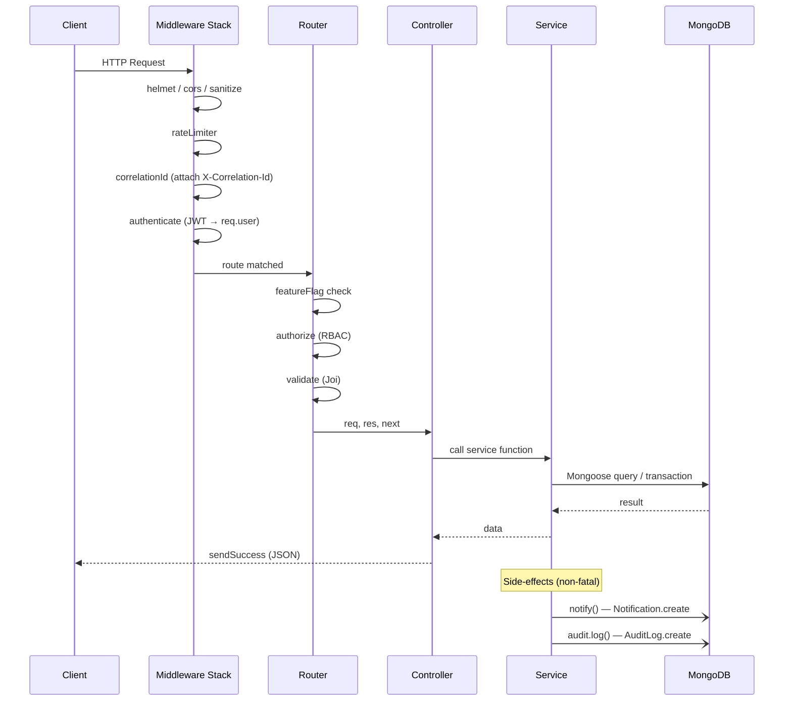
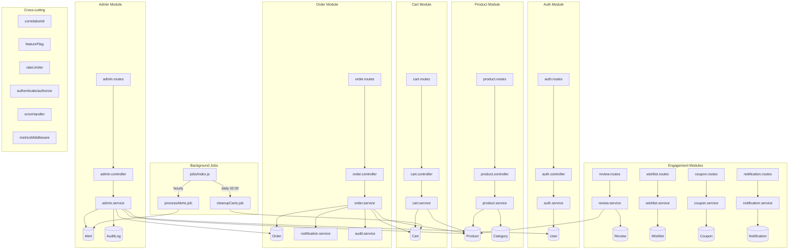
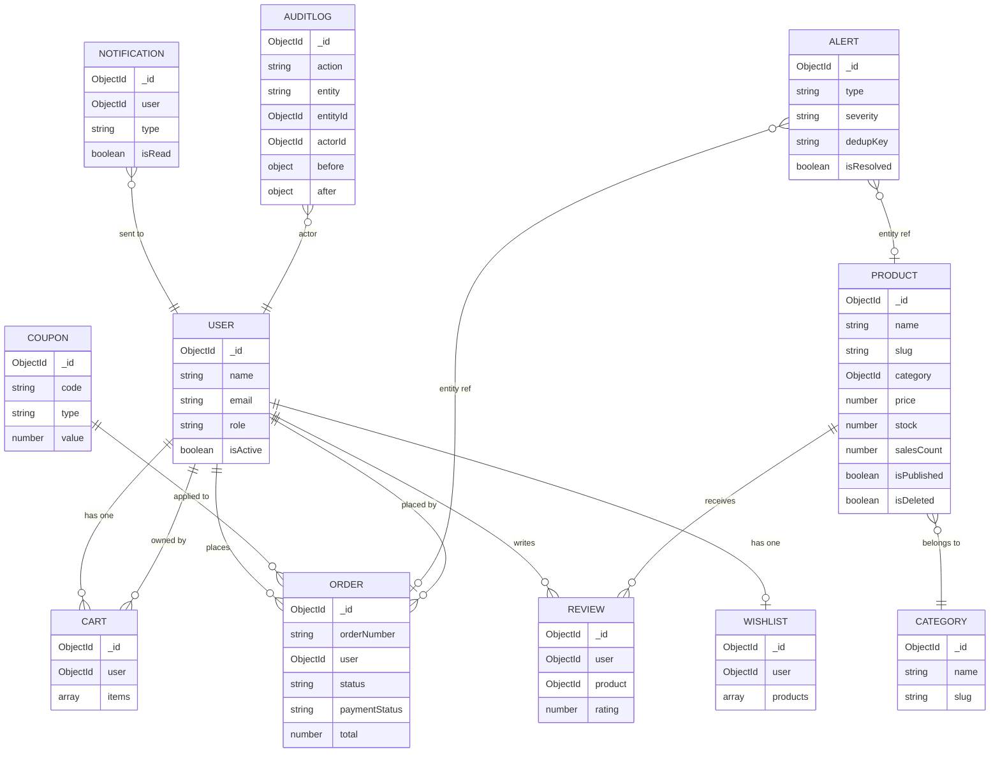

# TechVault3 — System Architecture

## Stack
- **Runtime**: Node.js 20 LTS + Express 4.x
- **Database**: MongoDB 7 + Mongoose 8 (transactions, aggregation pipelines)
- **Auth**: JWT (15m access / 7d refresh), bcryptjs, HttpOnly cookies
- **Validation**: Joi
- **Observability**: Winston + DailyRotateFile, Prometheus (prom-client), correlation IDs
- **Jobs**: node-cron (cleanup + alert processing)
- **Docs**: Swagger / OpenAPI 3.0

---

## Layer Architecture (A.N.T — three-layer)

```
┌─────────────────────────────────────────────────────────┐
│                      HTTP Clients                        │
└────────────────────────────┬────────────────────────────┘
                             │
┌────────────────────────────▼────────────────────────────┐
│               Express Middleware Stack                    │
│  Helmet · CORS · mongoSanitize · JSON · cookieParser      │
│  rateLimiter · metricsMiddleware · correlationId          │
└────────────────────────────┬────────────────────────────┘
                             │
┌────────────────────────────▼────────────────────────────┐
│                    Routes  (Layer 1)                      │
│  /auth  /products  /cart  /orders  /admin                 │
│  /reviews  /wishlist  /coupons  /notifications            │
│  FeatureFlag middleware guards optional modules           │
└────────────────────────────┬────────────────────────────┘
                             │
┌────────────────────────────▼────────────────────────────┐
│                Controllers  (Layer 2)                     │
│  Extract req params → call service → sendSuccess         │
│  All errors passed to next(err) → global errorHandler    │
└────────────────────────────┬────────────────────────────┘
                             │
┌────────────────────────────▼────────────────────────────┐
│                 Services  (Layer 3)                       │
│  Business logic, DB queries, Mongoose transactions        │
│  Non-fatal side-effects: notify(), audit.log()            │
└────────────────────────────┬────────────────────────────┘
                             │
┌────────────────────────────▼────────────────────────────┐
│               MongoDB (via Mongoose)                      │
│  User · Product · Category · Cart · Order                 │
│  Review · Wishlist · Coupon · Notification                │
│  Alert · AuditLog                                         │
└─────────────────────────────────────────────────────────┘
```

---

## Full Request-Flow Diagram



---

## Module Map



---

## Data Model Relationships



---

## API Surface

| Method | Path | Auth | Description |
|--------|------|------|-------------|
| POST | `/auth/register` | — | Register |
| POST | `/auth/login` | — | Login |
| POST | `/auth/refresh` | cookie | Rotate refresh token |
| POST | `/auth/logout` | Bearer | Logout |
| GET | `/auth/me` | Bearer | Own profile |
| PATCH | `/auth/me` | Bearer | Update profile |
| PATCH | `/auth/change-password` | Bearer | Change password |
| GET | `/products` | — | List products |
| GET | `/products/autocomplete` | — | Typeahead |
| GET | `/products/:slug` | — | Product detail |
| POST | `/products` | admin | Create product |
| PATCH | `/products/:id` | admin | Update product |
| DELETE | `/products/:id` | admin | Soft-delete |
| GET | `/products/:productId/reviews` | — | List reviews |
| POST | `/products/:productId/reviews` | Bearer | Create review |
| PATCH | `/reviews/:id` | Bearer | Update own review |
| DELETE | `/reviews/:id` | Bearer | Delete own review |
| GET | `/cart` | Bearer | Get cart |
| POST | `/cart` | Bearer | Add item |
| PATCH | `/cart/:productId` | Bearer | Update quantity |
| DELETE | `/cart/:productId` | Bearer | Remove item |
| DELETE | `/cart` | Bearer | Clear cart |
| POST | `/orders` | Bearer | Create order from cart |
| GET | `/orders` | Bearer | List own orders |
| GET | `/orders/all` | admin | List all orders |
| GET | `/orders/:id` | Bearer | Get order |
| PATCH | `/orders/:id/cancel` | Bearer | Cancel order |
| PATCH | `/orders/:id/status` | staff | Update status |
| GET | `/wishlist` | Bearer | Get wishlist |
| POST | `/wishlist` | Bearer | Add to wishlist |
| DELETE | `/wishlist/:productId` | Bearer | Remove from wishlist |
| GET | `/coupons/:code/validate` | Bearer | Validate coupon |
| POST | `/coupons` | admin | Create coupon |
| PATCH | `/coupons/:id/deactivate` | admin | Deactivate coupon |
| GET | `/notifications` | Bearer | List notifications |
| PATCH | `/notifications/read-all` | Bearer | Mark all read |
| PATCH | `/notifications/:id/read` | Bearer | Mark one read |
| DELETE | `/notifications/:id` | Bearer | Delete notification |
| GET | `/admin/dashboard` | admin | Dashboard summary |
| GET | `/admin/analytics/revenue` | admin | Revenue analytics |
| GET | `/admin/analytics/top-products` | admin | Top products |
| GET | `/admin/alerts` | admin | List alerts |
| PATCH | `/admin/alerts/:id/resolve` | admin | Resolve alert |
| GET | `/admin/audit-logs` | superadmin | Audit log |
| GET | `/admin/users` | superadmin | List users |
| PATCH | `/admin/users/:id` | superadmin | Update user |
| GET | `/health` | — | Health check |
| GET | `/metrics` | — | Prometheus metrics |

---

## Security Controls

| Layer | Control |
|-------|---------|
| Transport | HTTPS in prod, HSTS via Helmet |
| Headers | Helmet (CSP, X-Frame-Options, etc.) |
| Input | express-mongo-sanitize (NoSQL injection), Joi schema validation |
| Body | 10 KB size limit |
| Auth | JWT RS256-compatible secret, 15m access token lifetime |
| Sessions | Refresh token stored in DB — revocable on logout |
| Rate limiting | 100 req/15m general, 10 req/15m on auth routes |
| RBAC | 4-tier: user → warehouse → admin → superadmin |
| Brute force | Account lockout after failed login attempts |

---

## Observability

| Signal | Tool | Details |
|--------|------|---------|
| Structured logs | Winston + DailyRotateFile | JSON in prod, pretty in dev; error log separate |
| Correlation IDs | X-Correlation-Id header | Per-request tracing across logs |
| Metrics | Prometheus (prom-client) | HTTP duration histogram, request counter, active connections |
| Audit trail | AuditLog model | Before/after snapshots for all critical mutations |
| Alerting | Alert model + cron | Low stock, refund spikes, ranking drops |
