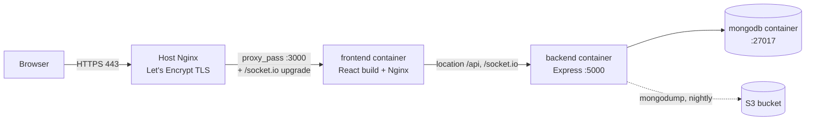
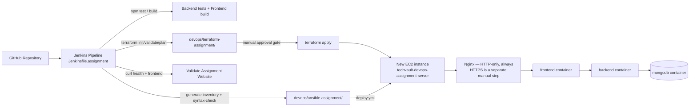

# TechVault — DevOps Final Assignment

This document has two halves that must never be confused with each other:

1. **Production** — already live, already deployed, not managed by this
   assignment's pipeline, and never to be touched by it.
2. **DevOps assignment environment** — a brand-new, disposable, fully
   isolated EC2 instance + its own Terraform state + its own Ansible
   inventory + its own Jenkins pipeline, created solely to demonstrate the
   Terraform → Ansible → Jenkins → validation workflow for grading.

If you only remember one rule from this document: **nothing under
`devops/terraform-assignment/`, `devops/ansible-assignment/`, or
`devops/jenkins/Jenkinsfile.assignment` is ever allowed to reference the
production instance ID, the production IPs, or `devops/terraform/` /
`devops/ansible/inventory.ini` directly** — and the assignment Jenkins
pipeline actively asserts this at runtime and fails the build if it's ever
violated (see `Jenkinsfile.assignment`, stage 11).

---

## 1. Production architecture (already live, unmanaged by this pipeline)



- Domain: `https://techvault.co.il` / `https://www.techvault.co.il`
- Deploy path in production today: `.github/workflows/deploy.yml`
  (`workflow_dispatch`, SSH + `git reset --hard` + `docker compose up -d
  --build`, with a pre-deploy MongoDB backup and a post-deploy health check)
- Terraform (`devops/terraform/`) and Ansible (`devops/ansible/`) describe
  how the production EC2 instance and its application stack were originally
  provisioned, but are **not** the live redeploy path today — see the
  Terraform/Ansible audit notes below for the exact gap.
- MongoDB backups run via `devops/scripts/backup-mongo.sh` (integrity
  checked, retained 30, optionally synced to S3) and can be restored via
  `devops/scripts/restore-mongo.sh` (double-confirmed, auto pre-restore
  backup).
- `devops/scripts/health-check.sh` runs a 14-point check (containers, health
  endpoint, frontend, disk, memory, backup freshness/integrity).

**This pipeline (Jenkinsfile.assignment) never runs any of the above against
production.**

---

## 2. DevOps assignment architecture (new, isolated, disposable)



- Environment name: `devops-assignment` (validated by Terraform variable
  rules, Ansible's inventory-group assertion, and the Jenkins pipeline)
- Own Terraform state: `devops/terraform-assignment/terraform.tfstate`
  (local, gitignored, never shared with `devops/terraform/terraform.tfstate`)
- Own Ansible inventory group: `techvault_assignment` (never `techvault`)
- Own deployment directory on the server: `/opt/techvault-assignment`
  (never `/opt/techvault`)
- Own SSH key pair: created fresh for this environment — must not be
  `techvault-key` (enforced by a Terraform variable validation)
- Own Jenkins credential IDs — all prefixed `..._ASSIGNMENT_...` or
  distinctly named, never reusing the production credential IDs

### HTTPS architecture decision (assignment environment)

**The assignment deploys HTTP-only, always. HTTPS/Certbot automation was
deliberately removed** after a review found that a manually-set "enable
HTTPS" flag, disconnected from whether a certificate actually existed yet,
could cause the Nginx template to reference a nonexistent certificate path —
which on a fresh instance can prevent Nginx from starting at all, breaking
HTTP too. See [`devops/ansible-assignment/README.md`](../ansible-assignment/README.md#https-architecture-decision)
for the full reasoning and the exact manual steps to add HTTPS later,
by hand, after a successful HTTP-only pipeline run.

---

## 3. File structure

```
devops/
├── terraform/                   PRODUCTION Terraform (existing, untouched)
├── terraform-assignment/        ASSIGNMENT Terraform — separate state, separate everything
│   ├── provider.tf
│   ├── variables.tf              environment_name, key_pair_name, allowed_ssh_cidr, Jenkins ingress vars
│   ├── main.tf                   Security group + EC2, with lifecycle preconditions
│   ├── outputs.tf                assignment_instance_id/public_ip/private_ip/frontend_url/jenkins_url
│   ├── terraform.tfvars.example
│   └── README.md
├── ansible/                      PRODUCTION Ansible (existing, untouched)
├── ansible-assignment/           ASSIGNMENT Ansible — separate inventory group, separate deploy dir
│   ├── deploy.yml
│   ├── inventory.example.ini
│   ├── group_vars/techvault_assignment.yml
│   ├── templates/env.docker.assignment.j2
│   ├── templates/nginx-assignment.conf.j2
│   └── README.md
├── jenkins/
│   ├── Jenkinsfile               PRODUCTION pipeline (existing, untouched)
│   ├── Jenkinsfile.assignment    ASSIGNMENT pipeline — 15 stages + safety guards
│   └── README.md                 Jenkins host plan, plugins, instructor permission model
└── docs/
    └── DEVOPS_ASSIGNMENT.md      This file
```

---

## 4. Assignment Jenkins pipeline — stage by stage

| # | Stage | What it does |
|---|-------|-------------|
| 1 | **Checkout** | Pull latest code from GitHub |
| 2 | **Validate Project** | Static safety guard (paths/env-name never resemble production) + required-file check + fails fast if `ASSIGNMENT_KEY_PAIR_NAME`/`ASSIGNMENT_SSH_CIDR` job parameters are blank or unsafe |
| 3 | **Run Backend Tests** | `npm ci && npm test` |
| 4 | **Build Frontend** | `npm ci && npm run build` in `client/` |
| 5 | **Validate Docker Compose** | `docker compose config --quiet` |
| 6 | **Terraform Init** | `terraform init` in `devops/terraform-assignment/` |
| 7 | **Terraform Validate** | `terraform validate` |
| 8 | **Terraform Plan** | `terraform plan -var="environment_name=..." -var="key_pair_name=..." -var="allowed_ssh_cidr=..." -var="aws_region=..." -var="instance_type=..."` — the four non-secret values come from Jenkins job parameters, since `terraform.tfvars` is gitignored and never present on a fresh workspace (see §5) |
| 9 | **Manual Approval** | **Human must click Apply** after reviewing the plan |
| 10 | **Terraform Apply** | Creates the assignment EC2 + security group |
| 11 | **Read Assignment Outputs** | Extracts IDs/IPs — **fails the build** if any resolved value equals a production identifier |
| 12 | **Generate Assignment Inventory** | Writes `ansible-assignment/inventory.ini` from step 11 |
| 13 | **Ansible Syntax Check** | `ansible-playbook --syntax-check` |
| 14 | **Ansible Deploy** | Runs `deploy.yml` with injected secrets |
| 15 | **Validate Assignment Website** | curl health + frontend, fails build on non-200 |

---

## 5. Required credentials — configure in Jenkins

Go to: **Manage Jenkins → Credentials → System → Global credentials → Add Credential**

| Credential ID | Kind | Value |
|--------------|------|-------|
| `AWS_ASSIGNMENT_CREDENTIALS_ID` | Amazon Web Services | Access key + secret for a **dedicated, assignment-scoped IAM user** — not `AdministratorAccess`, not the production deployment credential. See [`devops/jenkins/README.md`](../jenkins/README.md#aws-iam--assignment-scoped-credentials-not-administratoraccess) for the permission outline |
| `SSH_ASSIGNMENT_KEY_CREDENTIALS_ID` | SSH Username with private key | username: `ubuntu`, private key: the **new** assignment `.pem`. Must be the private half of whatever key pair name you pass as `ASSIGNMENT_KEY_PAIR_NAME` (see §5.1 below) |
| `TECHVAULT_ASSIGNMENT_JWT_ACCESS_SECRET` | Secret text | Random string, min 32 chars |
| `TECHVAULT_ASSIGNMENT_JWT_REFRESH_SECRET` | Secret text | Random string, min 32 chars |
| `TECHVAULT_ASSIGNMENT_COOKIE_SECRET` | Secret text | Random string, min 32 chars |

### 5.1 Key-pair consistency (a common failure mode)

`ASSIGNMENT_KEY_PAIR_NAME` (job parameter, passed to Terraform) and
`SSH_ASSIGNMENT_KEY_CREDENTIALS_ID` (Jenkins credential, used by Ansible)
name **the same conceptual key pair from two different sides**:

- `ASSIGNMENT_KEY_PAIR_NAME` is the **name** AWS knows the key pair by —
  Terraform passes it to `aws_instance.key_name` so EC2 installs its public
  half onto the new instance.
- `SSH_ASSIGNMENT_KEY_CREDENTIALS_ID` is the **private key file** Jenkins
  injects for Ansible to actually SSH in with.

They must be the matching pair for the same AWS key pair. If they aren't —
e.g. the parameter names one key pair but the Jenkins credential holds a
different key's private half — Terraform Apply (stage 10) will still
succeed (it only needs the *name* to exist in AWS), and the pipeline will
only fail later, at Ansible Deploy (stage 14), with an SSH authentication
error. This is a real, easy-to-hit mismatch, not a hypothetical: keep both
pointed at the *same* dedicated assignment key pair, and never reuse the
production key pair (`techvault-key`) for either — no PEM file content is
ever committed to this repository, in either case.

Generate secure secrets:
```bash
node -e "console.log(require('crypto').randomBytes(32).toString('hex'))"
```

Optional, only if exercised: `TECHVAULT_ASSIGNMENT_GOOGLE_CLIENT_ID` (Secret
text), `TECHVAULT_REPO_CREDENTIALS_ID` (Username with password, only if the
repository is private).

### Required job parameters (not secrets — "Build with Parameters")

`devops/terraform-assignment/variables.tf` intentionally has no default for
`key_pair_name` or `allowed_ssh_cidr`. A fresh Jenkins workspace has no
`terraform.tfvars` (gitignored), so these must be supplied as job
parameters, not baked into any file:

| Parameter | Default | Required? |
|---|---|---|
| `ASSIGNMENT_KEY_PAIR_NAME` | *(none)* | Yes — build fails fast (stage 2) if blank or `techvault-key` |
| `ASSIGNMENT_SSH_CIDR` | *(none)* | Yes — build fails fast (stage 2) if blank, `0.0.0.0/0`, missing a `/prefix`, prefix outside 0-32, or an IPv4 octet outside 0-255 |
| `ASSIGNMENT_AWS_REGION` | `eu-central-1` | No |
| `ASSIGNMENT_INSTANCE_TYPE` | `t3.small` | No |

These four values flow only into `terraform plan -var=...` (stage 8); the
saved plan file is what `terraform apply` (stage 10) actually applies, so
the same values never need to be repeated or re-typed at apply time.

---

## 6. Instructor Jenkins user

See [`devops/jenkins/README.md`](../jenkins/README.md) for the full plugin
list and host topology recommendation. Summary:

1. Install **Role-Based Authorization Strategy**.
2. Create a dedicated account for the instructor.
3. Grant only `Overall/Read`, `Job/Read`, `Job/Build` (and `Job/Workspace`
   if needed) on the assignment pipeline job.
4. Do not grant `Overall/Administer`, credentials access, or node/plugin
   administration.
5. Verify by logging in as that account before sending credentials to the
   instructor.

---

## 7. Safe workflows

### Create

```bash
cd devops/terraform-assignment
cp terraform.tfvars.example terraform.tfvars   # fill in key_pair_name, allowed_ssh_cidr
terraform init
terraform validate
terraform plan       # confirm it only shows resources to CREATE
terraform apply
```
Or trigger `Jenkinsfile.assignment` end to end (recommended — proves the
whole pipeline, not just Terraform).

### Validate

```bash
SERVER_IP=$(cd devops/terraform-assignment && terraform output -raw assignment_public_ip)
curl http://$SERVER_IP/api/v1/health
# Open browser: http://$SERVER_IP/
```

### Destroy (assignment only — cleanup after grading)

```bash
cd devops/terraform-assignment
terraform destroy
```

This can only ever affect resources tracked in
`devops/terraform-assignment/terraform.tfstate` — the assignment instance
and its security group. **Never run `terraform destroy` from
`devops/terraform/` — that state manages the real production server.** If
you are ever unsure which directory you are in, run `pwd` and confirm it
ends in `terraform-assignment` before typing `yes`.

---

## 8. Screenshots checklist for submission

- [ ] Jenkins pipeline — all 15 stages green (`Jenkinsfile.assignment`)
- [ ] Jenkins "Terraform Plan" stage output visible in logs
- [ ] Jenkins "Manual Approval" gate (before clicking Apply)
- [ ] Jenkins "Validate Assignment Website" stage output
- [ ] AWS Console → EC2 → the assignment instance (public IP visible)
- [ ] AWS Console → Security Groups → the assignment SG (inbound rules)
- [ ] Browser → assignment frontend homepage
- [ ] Browser → assignment `/api/v1/health` — JSON response
- [ ] Jenkins → instructor user's permission matrix (proving no admin rights)
- [ ] Terminal → `terraform output` (assignment directory) showing IDs/IPs
- [ ] Terminal → `terraform destroy` (assignment directory only, after grading)

---

## 9. Estimated AWS cost

A rough range for the assignment environment while it exists (one
`t3.small`, one 20 GB gp3 volume, in `eu-central-1`, running continuously):
approximately **$15–25/month** if left running for a full month, or a few
cents to low dollars for a short-lived grading window measured in hours —
this is a ballpark for budgeting purposes, not an invoice; check the AWS
Pricing Calculator for a current, region-accurate figure before committing
to a longer-running instance.

---

## 10. Secrets and gitignore

| What | Where it lives | Tracked in git? |
|---|---|---|
| Assignment AWS credentials, SSH key, JWT/cookie secrets | Jenkins → Manage Credentials | No — never committed |
| `devops/terraform-assignment/terraform.tfvars` | Local disk only | No — gitignored |
| `devops/terraform-assignment/terraform.tfstate*` | Local disk only | No — gitignored |
| `devops/ansible-assignment/inventory.ini` | Local disk / Jenkins workspace (deleted in `post { always }`) | No — gitignored |
| Assignment `.pem` key | Your `~/.ssh/` | No — `*.pem` is gitignored globally |
| Assignment `.env.docker` (rendered on the server) | `/opt/techvault-assignment/.env.docker` on the EC2 instance | No — never leaves the server |

Production's equivalent files (`devops/terraform/terraform.tfvars`,
`terraform.tfstate*`, `devops/ansible/inventory.ini`) follow the same
gitignore rules and are unaffected by any of the above.

---

## 11. Troubleshooting

| Problem | Likely cause | Fix |
|---------|-------------|-----|
| `terraform apply` fails: `InvalidKeyPair.NotFound` | Assignment key pair doesn't exist in AWS yet | Create it in the AWS console first — do not reuse `techvault-key` |
| Jenkins stage 11 fails with "REFUSING TO CONTINUE" | Terraform outputs resolved to a production identifier | Stop immediately — this means something is misconfigured; do not attempt to bypass the check |
| Ansible SSH timeout | EC2 still initializing | Wait ~60s after apply, re-run |
| Backend container exits | `.env.docker` secrets too short (<32 chars) | Check the three secret credentials in Jenkins |
| Frontend shows blank page | Nginx site not enabled / config invalid | `sudo nginx -t`, check `docker compose logs frontend` |
