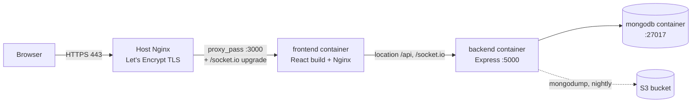
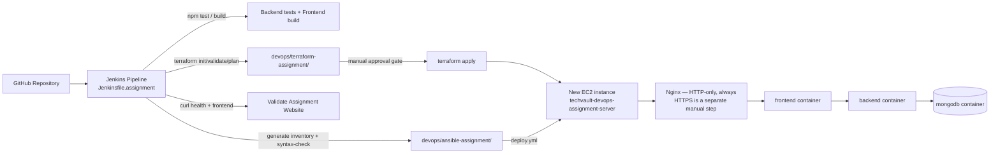
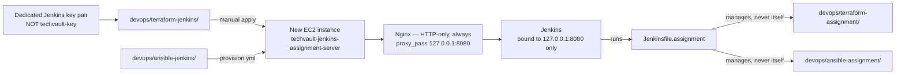

# TechVault — DevOps Final Assignment

This document has three parts that must never be confused with each other:

1. **Production** — already live, already deployed, not managed by this
   assignment's pipeline, and never to be touched by it.
2. **DevOps assignment application environment** — a brand-new, disposable,
   fully isolated EC2 instance + its own Terraform state + its own Ansible
   inventory, created solely to demonstrate the Terraform → Ansible →
   validation workflow for grading.
3. **Jenkins host** — a separate, persistent EC2 instance that runs the
   Jenkins pipeline itself, with its own Terraform state and its own Ansible
   inventory, independent of both of the above.

If you only remember one rule from this document: **nothing under
`devops/terraform-assignment/`, `devops/ansible-assignment/`,
`devops/terraform-jenkins/`, `devops/ansible-jenkins/`, or
`devops/jenkins/Jenkinsfile.assignment` is ever allowed to reference the
production instance ID, the production IPs, or `devops/terraform/` /
`devops/ansible/inventory.ini` directly** — and the assignment Jenkins
pipeline actively asserts this at runtime and fails the build if it's ever
violated (see `Jenkinsfile.assignment`, stage 11).

---

## 1. Production architecture (already live, unmanaged by this pipeline)



- Domain: `https://techvault.co.il` / `https://www.techvault.co.il`
- Deploy path in production today: `.github/workflows/deploy.yml`
  (`workflow_dispatch`, SSH + `git reset --hard` + `docker compose up -d
  --build`, with a pre-deploy MongoDB backup and a post-deploy health check)
- Terraform (`devops/terraform/`) and Ansible (`devops/ansible/`) describe
  how the production EC2 instance and its application stack were originally
  provisioned, but are **not** the live redeploy path today — see the
  Terraform/Ansible audit notes below for the exact gap.
- MongoDB backups run via `devops/scripts/backup-mongo.sh` (integrity
  checked, retained 30, optionally synced to S3) and can be restored via
  `devops/scripts/restore-mongo.sh` (double-confirmed, auto pre-restore
  backup).
- `devops/scripts/health-check.sh` runs a 14-point check (containers, health
  endpoint, frontend, disk, memory, backup freshness/integrity).

**Neither the assignment application pipeline nor the Jenkins host ever runs
any of the above against production.**

---

## 2. DevOps assignment application architecture (new, isolated, disposable)



- Environment name: `devops-assignment` (validated by Terraform variable
  rules, Ansible's inventory-group assertion, and the Jenkins pipeline)
- Own Terraform state: `devops/terraform-assignment/terraform.tfstate`
  (local, gitignored, never shared with `devops/terraform/terraform.tfstate`)
- Own Ansible inventory group: `techvault_assignment` (never `techvault`)
- Own deployment directory on the server: `/opt/techvault-assignment`
  (never `/opt/techvault`)
- Own SSH key pair: created fresh for this environment — must not be
  `techvault-key` (enforced by a Terraform variable validation)
- Own Jenkins credential IDs — all prefixed `..._ASSIGNMENT_...` or
  distinctly named, never reusing the production credential IDs

### HTTPS architecture decision (assignment application environment)

**The assignment application deploys HTTP-only, always. HTTPS/Certbot
automation was deliberately removed** after a review found that a
manually-set "enable HTTPS" flag, disconnected from whether a certificate
actually existed yet, could cause the Nginx template to reference a
nonexistent certificate path — which on a fresh instance can prevent Nginx
from starting at all, breaking HTTP too. See
[`devops/ansible-assignment/README.md`](../ansible-assignment/README.md#https-architecture-decision)
for the full reasoning and the exact manual steps to add HTTPS later,
by hand, after a successful HTTP-only pipeline run.

---

## 3. Jenkins host architecture (new, isolated, persistent)



Unlike the assignment application server, the Jenkins host is **persistent**
— it is not created and destroyed by any pipeline; it's the thing that runs
the pipeline. It has its own lifecycle, managed manually (see "Cost and
cleanup" below).

- Environment name: `jenkins-assignment` (validated by Terraform variable
  rules, same regex-based production-name rejection as the application
  module)
- Own Terraform state: `devops/terraform-jenkins/terraform.tfstate` — a
  *third* independent state file, alongside production's and the
  application's; no `terraform_remote_state` reference to either
- Own Ansible inventory group: `jenkins_assignment` (never `techvault` or
  `techvault_assignment`)
- Own SSH key pair: a *third*, dedicated key pair — must not be
  `techvault-key`, and must not be whatever key pair you chose for the
  assignment application server (Terraform can't check the second part
  automatically, since this module deliberately has no reference to the
  application module's state — verify it yourself)
- Jenkins's own port (8080) is never opened in the security group; Jenkins
  is bound to `127.0.0.1:8080` via a single systemd drop-in override
  (`JENKINS_OPTS`, not the legacy `/etc/default/jenkins` +
  `JENKINS_ARGS` convention — that file is intentionally left unedited) — see
  [`devops/ansible-jenkins/README.md`](../ansible-jenkins/README.md#jenkins-binding-mechanism)
  for the full reasoning — only reachable through the host's own Nginx on
  80/443, and verified against the live listening socket by the playbook's
  validation section rather than assumed from configuration alone
- Java: OpenJDK 17 (Jenkins LTS's minimum required version since the 2.426
  line), from Ubuntu 22.04's own repositories

### Instance sizing (Jenkins host)

Default `t3.medium` (2 vCPU / 4 GB), not `t3.small` — Jenkins's JVM, Docker
builds, `npm`, Terraform, and Ansible all running from one host benefit from
the extra headroom; this favors reliability over the cheapest option.
`t3.small` remains supported (documented tradeoff, pairs with an idempotent
swapfile) — see `devops/terraform-jenkins/README.md` and
`devops/ansible-jenkins/README.md` for the full reasoning.

### Public IP stability (Jenkins host)

No Elastic IP by default — the instance's public IP changes on stop/start
(not on a plain reboot). Fine if the host runs continuously for the life of
the assignment; if you plan to stop it between work sessions, set
`enable_elastic_ip = true` in `devops/terraform-jenkins/terraform.tfvars`
*before* the first stop. See that module's README "Elastic IP decision" for
the full tradeoff — no Elastic IP is created unless you opt in.

### HTTPS architecture decision (Jenkins host)

**Same decision, same reasoning as the assignment application server:**
HTTP-only, always, by design. `jenkins-nginx.conf.j2` has no HTTPS branch,
so it can never fail to start Nginx because a certificate doesn't exist yet.
See [`devops/ansible-jenkins/README.md`](../ansible-jenkins/README.md#https-architecture-decision)
for the exact manual Certbot command and its one documented caveat.

---

## 4. File structure

```
devops/
├── terraform/                   PRODUCTION Terraform (existing, untouched)
├── terraform-assignment/        ASSIGNMENT APPLICATION Terraform — separate state, separate everything
│   ├── provider.tf
│   ├── variables.tf              environment_name, key_pair_name, allowed_ssh_cidr, Jenkins ingress vars
│   ├── main.tf                   Security group + EC2, with lifecycle preconditions
│   ├── outputs.tf                assignment_instance_id/public_ip/private_ip/frontend_url/jenkins_url
│   ├── terraform.tfvars.example
│   └── README.md
├── terraform-jenkins/           JENKINS HOST Terraform — a third, separate state
│   ├── provider.tf
│   ├── variables.tf              environment_name, key_pair_name, allowed_ssh_cidr, instance_type, jenkins_domain
│   ├── main.tf                   Security group (22/80/443 only — never 8080) + EC2
│   ├── outputs.tf                jenkins_instance_id/public_ip/private_ip/http_url/domain_url
│   ├── terraform.tfvars.example
│   └── README.md
├── ansible/                      PRODUCTION Ansible (existing, untouched)
├── ansible-assignment/           ASSIGNMENT APPLICATION Ansible — separate inventory group, separate deploy dir
│   ├── deploy.yml
│   ├── inventory.example.ini
│   ├── group_vars/techvault_assignment.yml
│   ├── templates/env.docker.assignment.j2
│   ├── templates/nginx-assignment.conf.j2
│   └── README.md
├── ansible-jenkins/              JENKINS HOST Ansible — provisions Jenkins/Docker/Terraform/Ansible/Node
│   ├── provision.yml
│   ├── inventory.example.ini
│   ├── group_vars/jenkins_assignment.yml
│   ├── templates/jenkins-nginx.conf.j2
│   └── README.md
├── jenkins/
│   ├── Jenkinsfile               PRODUCTION pipeline (existing, untouched)
│   ├── Jenkinsfile.assignment    ASSIGNMENT pipeline — 15 stages + safety guards
│   └── README.md                 Jenkins host plan, setup sequence, plugins, instructor permission model
└── docs/
    └── DEVOPS_ASSIGNMENT.md      This file
```

---

## 5. Assignment Jenkins pipeline — stage by stage

| # | Stage | What it does |
|---|-------|-------------|
| 1 | **Checkout** | Pull latest code from GitHub |
| 2 | **Validate Project** | Static safety guard (paths/env-name never resemble production) + required-file check + fails fast if `ASSIGNMENT_KEY_PAIR_NAME`/`ASSIGNMENT_SSH_CIDR` job parameters are blank or unsafe |
| 3 | **Run Backend Tests** | `npm ci && npm test` |
| 4 | **Build Frontend** | `npm ci && npm run build` in `client/` |
| 5 | **Validate Docker Compose** | `docker compose config --quiet` |
| 6 | **Terraform Init** | `terraform init` in `devops/terraform-assignment/` |
| 7 | **Terraform Validate** | `terraform validate` |
| 8 | **Terraform Plan** | `terraform plan -var="environment_name=..." -var="key_pair_name=..." -var="allowed_ssh_cidr=..." -var="aws_region=..." -var="instance_type=..."` — the four non-secret values come from Jenkins job parameters, since `terraform.tfvars` is gitignored and never present on a fresh workspace (see §6) |
| 9 | **Manual Approval** | **Human must click Apply** after reviewing the plan |
| 10 | **Terraform Apply** | Creates the assignment EC2 + security group |
| 11 | **Read Assignment Outputs** | Extracts IDs/IPs — **fails the build** if any resolved value equals a production identifier |
| 12 | **Generate Assignment Inventory** | Writes `ansible-assignment/inventory.ini` from step 11 |
| 13 | **Ansible Syntax Check** | `ansible-playbook --syntax-check` |
| 14 | **Ansible Deploy** | Runs `deploy.yml` with injected secrets |
| 15 | **Validate Assignment Website** | curl health + frontend, fails build on non-200 |

This pipeline itself runs *on* the Jenkins host from §3 — it does not
provision or manage that host; `devops/ansible-jenkins/provision.yml` does,
manually, before any of this can run.

---

## 6. Required credentials — configure in Jenkins

Go to: **Manage Jenkins → Credentials → System → Global credentials → Add Credential**

| Credential ID | Kind | Value |
|--------------|------|-------|
| `AWS_ASSIGNMENT_CREDENTIALS_ID` | Amazon Web Services | Access key + secret for a **dedicated, assignment-scoped IAM user** — not `AdministratorAccess`, not the production deployment credential. See [`devops/jenkins/README.md`](../jenkins/README.md#aws-iam--assignment-scoped-credentials-not-administratoraccess) for the permission outline |
| `SSH_ASSIGNMENT_KEY_CREDENTIALS_ID` | SSH Username with private key | username: `ubuntu`, private key: the **new** assignment `.pem`. Must be the private half of whatever key pair name you pass as `ASSIGNMENT_KEY_PAIR_NAME` (see §6.1 below) |
| `TECHVAULT_ASSIGNMENT_JWT_ACCESS_SECRET` | Secret text | Random string, min 32 chars |
| `TECHVAULT_ASSIGNMENT_JWT_REFRESH_SECRET` | Secret text | Random string, min 32 chars |
| `TECHVAULT_ASSIGNMENT_COOKIE_SECRET` | Secret text | Random string, min 32 chars |

### 6.1 Key-pair consistency (a common failure mode)

`ASSIGNMENT_KEY_PAIR_NAME` (job parameter, passed to Terraform) and
`SSH_ASSIGNMENT_KEY_CREDENTIALS_ID` (Jenkins credential, used by Ansible)
name **the same conceptual key pair from two different sides**:

- `ASSIGNMENT_KEY_PAIR_NAME` is the **name** AWS knows the key pair by —
  Terraform passes it to `aws_instance.key_name` so EC2 installs its public
  half onto the new instance.
- `SSH_ASSIGNMENT_KEY_CREDENTIALS_ID` is the **private key file** Jenkins
  injects for Ansible to actually SSH in with.

They must be the matching pair for the same AWS key pair. If they aren't —
e.g. the parameter names one key pair but the Jenkins credential holds a
different key's private half — Terraform Apply (stage 10) will still
succeed (it only needs the *name* to exist in AWS), and the pipeline will
only fail later, at Ansible Deploy (stage 14), with an SSH authentication
error. This is a real, easy-to-hit mismatch, not a hypothetical: keep both
pointed at the *same* dedicated assignment key pair, and never reuse the
production key pair (`techvault-key`) for either — no PEM file content is
ever committed to this repository, in either case.

The same consistency requirement applies one level up, between the Jenkins
host's own `key_pair_name` (Terraform variable, in
`devops/terraform-jenkins/terraform.tfvars`) and whatever `.pem` you actually
use to SSH into the Jenkins host to run `devops/ansible-jenkins/provision.yml`
— that pairing has no Jenkins credential involved at all (you run it
manually, before Jenkins exists), so the only guard against a mismatch there
is checking it yourself.

Generate secure secrets:
```bash
node -e "console.log(require('crypto').randomBytes(32).toString('hex'))"
```

Optional, only if exercised: `TECHVAULT_ASSIGNMENT_GOOGLE_CLIENT_ID` (Secret
text), `TECHVAULT_REPO_CREDENTIALS_ID` (Username with password, only if the
repository is private).

### Required job parameters (not secrets — "Build with Parameters")

`devops/terraform-assignment/variables.tf` intentionally has no default for
`key_pair_name` or `allowed_ssh_cidr`. A fresh Jenkins workspace has no
`terraform.tfvars` (gitignored), so these must be supplied as job
parameters, not baked into any file:

| Parameter | Default | Required? |
|---|---|---|
| `ASSIGNMENT_KEY_PAIR_NAME` | *(none)* | Yes — build fails fast (stage 2) if blank, `techvault-key`, or contains characters outside `[A-Za-z0-9_.-]` |
| `ASSIGNMENT_SSH_CIDR` | *(none)* | Yes — build fails fast (stage 2) if blank, `0.0.0.0/0`, missing a `/prefix`, prefix outside 0-32, or an IPv4 octet outside 0-255 |
| `ASSIGNMENT_AWS_REGION` | `eu-central-1` | No |
| `ASSIGNMENT_INSTANCE_TYPE` | `t3.small` | No |

These four values flow only into `terraform plan -var=...` (stage 8); the
saved plan file is what `terraform apply` (stage 10) actually applies, so
the same values never need to be repeated or re-typed at apply time.

---

## 7. Instructor Jenkins user

See [`devops/jenkins/README.md`](../jenkins/README.md) for the full plugin
list, host topology, and complete 15-step setup sequence. Summary:

1. Install **Role-Based Authorization Strategy**.
2. Create a dedicated account for the instructor.
3. Grant only `Overall/Read`, `Job/Read`, `Job/Build` (and `Job/Workspace`
   if needed) on the assignment pipeline job.
4. Do not grant `Overall/Administer`, credentials access, or node/plugin
   administration.
5. Verify by logging in as that account before sending credentials to the
   instructor.

---

## 8. Safe workflows

### Create the assignment application environment

```bash
cd devops/terraform-assignment
cp terraform.tfvars.example terraform.tfvars   # fill in key_pair_name, allowed_ssh_cidr
terraform init
terraform validate
terraform plan       # confirm it only shows resources to CREATE
terraform apply
```
Or trigger `Jenkinsfile.assignment` end to end (recommended — proves the
whole pipeline, not just Terraform) — but that pipeline needs the Jenkins
host below to exist first.

### Create the Jenkins host

```bash
cd devops/terraform-jenkins
cp terraform.tfvars.example terraform.tfvars   # fill in key_pair_name, allowed_ssh_cidr
terraform init
terraform validate
terraform plan        # confirm it only shows resources to CREATE
terraform apply
cd ../ansible-jenkins
cp inventory.example.ini inventory.ini   # fill in the Jenkins host IP + key path
ansible-playbook -i inventory.ini provision.yml
```

### Validate

```bash
# Assignment application
SERVER_IP=$(cd devops/terraform-assignment && terraform output -raw assignment_public_ip)
curl http://$SERVER_IP/api/v1/health

# Jenkins host
JENKINS_IP=$(cd devops/terraform-jenkins && terraform output -raw jenkins_public_ip)
curl -o /dev/null -w '%{http_code}\n' http://$JENKINS_IP/
```

### Destroy (cleanup after grading — never production)

```bash
# Assignment application only
cd devops/terraform-assignment
terraform destroy

# Jenkins host only, once you no longer need it (see "Cost and cleanup")
cd devops/terraform-jenkins
terraform destroy
```

Each `terraform destroy` can only ever affect resources tracked in *that
directory's own* state. **Never run `terraform destroy` from
`devops/terraform/`** — that state manages the real production server. If
you are ever unsure which directory you are in, run `pwd` and confirm it
ends in `terraform-assignment` or `terraform-jenkins` (never bare
`terraform`) before typing `yes`.

---

## 9. Screenshots checklist for submission

- [ ] Jenkins pipeline — all 15 stages green (`Jenkinsfile.assignment`)
- [ ] Jenkins "Terraform Plan" stage output visible in logs
- [ ] Jenkins "Manual Approval" gate (before clicking Apply)
- [ ] Jenkins "Validate Assignment Website" stage output
- [ ] AWS Console → EC2 → the assignment instance (public IP visible)
- [ ] AWS Console → EC2 → the Jenkins host instance (public IP visible)
- [ ] AWS Console → Security Groups → the assignment SG (inbound rules)
- [ ] AWS Console → Security Groups → the Jenkins SG (inbound rules — confirm no 8080 rule)
- [ ] Browser → assignment frontend homepage
- [ ] Browser → assignment `/api/v1/health` — JSON response
- [ ] Browser → Jenkins login page over its own public URL
- [ ] Jenkins → instructor user's permission matrix (proving no admin rights)
- [ ] Terminal → `terraform output` (assignment directory) showing IDs/IPs
- [ ] Terminal → `terraform output` (Jenkins directory) showing IDs/IPs
- [ ] Terminal → `terraform destroy` (assignment directory only, after grading)

---

## 10. Cost and cleanup

Cost depends on instance type and running hours — this section explains the
factors, not an exact bill; check the AWS Pricing Calculator for a current,
region-accurate figure before committing to a longer-running instance.

**Factors:**
- The Jenkins host (`devops/terraform-jenkins/`, default `t3.medium`, 40 GB
  gp3) runs for as long as you keep it — it is not created/destroyed by any
  pipeline, so its cost accrues the whole time it exists, independent of how
  often you actually run a build.
- The assignment application server (`devops/terraform-assignment/`,
  default `t3.small`, 20 GB gp3) only exists between a pipeline's Terraform
  Apply and whenever you `terraform destroy` it — no pipeline run, no cost
  from this one.
- EBS (root volume) storage costs money for as long as the volume exists,
  **including while the instance is stopped** — stopping an instance halts
  compute charges but not storage charges.
- Stopping either instance (rather than destroying it) between work
  sessions is a reasonable way to pause compute cost while keeping
  configuration/history intact — this works for the Jenkins host (stop/start
  preserves Jenkins home, jobs, credentials) but is not the normal lifecycle
  for the assignment application server, which is meant to be recreated by
  the pipeline anyway.
- Both an automatically assigned EC2 public IPv4 address and an Elastic IP
  can incur public IPv4 address charges — an Elastic IP
  (`devops/terraform-jenkins/`'s `enable_elastic_ip`) is chosen for address
  *stability* across stop/start, not as a free alternative. Check current
  AWS pricing for public IPv4 addresses before relying on either for a
  long-running host, and release any Elastic IP you created during final
  cleanup.

**Recommended lifecycle:**
- **Never destroy production** — this bears repeating: `devops/terraform/`
  manages the real, live TechVault server; no destroy command should ever
  target it.
- The assignment application environment can be destroyed after grading is
  fully complete (all screenshots and the instructor's own pipeline run are
  done) — see "Destroy" above.
- **Preserve the Jenkins host until all screenshots and instructor access
  are complete.** Recreating it means reinstalling Jenkins, reconfiguring
  plugins/credentials, and recreating the instructor's account and role from
  scratch — there is no benefit to tearing it down early, only risk of
  having to redo setup under time pressure.

---

## 11. Secrets and gitignore

| What | Where it lives | Tracked in git? |
|---|---|---|
| Assignment AWS credentials, SSH key, JWT/cookie secrets | Jenkins → Manage Credentials | No — never committed |
| `devops/terraform-assignment/terraform.tfvars` | Local disk only | No — gitignored |
| `devops/terraform-assignment/terraform.tfstate*` | Local disk only | No — gitignored |
| `devops/ansible-assignment/inventory.ini` | Local disk / Jenkins workspace (deleted in `post { always }`) | No — gitignored |
| `devops/terraform-jenkins/terraform.tfvars` | Local disk only | No — gitignored |
| `devops/terraform-jenkins/terraform.tfstate*` | Local disk only | No — gitignored |
| `devops/ansible-jenkins/inventory.ini` | Local disk only | No — gitignored |
| Assignment / Jenkins-host `.pem` keys | Your `~/.ssh/` | No — `*.pem` is gitignored globally |
| Assignment `.env.docker` (rendered on the server) | `/opt/techvault-assignment/.env.docker` on the EC2 instance | No — never leaves the server |
| Jenkins initial admin password | `/var/lib/jenkins/secrets/initialAdminPassword` on the Jenkins host | No — never leaves the server; retrieved manually over SSH |

Production's equivalent files (`devops/terraform/terraform.tfvars`,
`terraform.tfstate*`, `devops/ansible/inventory.ini`) follow the same
gitignore rules and are unaffected by any of the above.

---

## 12. Troubleshooting

| Problem | Likely cause | Fix |
|---------|-------------|-----|
| `terraform apply` fails: `InvalidKeyPair.NotFound` | Key pair doesn't exist in AWS yet (assignment or Jenkins host) | Create it in the AWS console first — do not reuse `techvault-key` |
| Jenkins stage 11 fails with "REFUSING TO CONTINUE" | Terraform outputs resolved to a production identifier | Stop immediately — this means something is misconfigured; do not attempt to bypass the check |
| Ansible SSH timeout | EC2 still initializing | Wait ~60s after apply, re-run |
| Backend container exits | `.env.docker` secrets too short (<32 chars) | Check the three secret credentials in Jenkins |
| Frontend shows blank page | Nginx site not enabled / config invalid | `sudo nginx -t`, check `docker compose logs frontend` |
| Jenkins unreachable at `http://<ip>/` | Nginx not running, or Jenkins still starting (can take ~30-60s after boot) | `sudo systemctl status nginx jenkins`, `sudo nginx -t`, retry |
| `curl http://localhost:8080` fails from your workstation | Expected — Jenkins is bound to `127.0.0.1:8080` on the host itself, not reachable directly from outside | Use the Nginx-proxied URL on port 80/443 instead |
