# TechVault — DevOps Final Assignment

**Status: complete — Build #8, `TechVault-DevOps-Assignment`, Finished: SUCCESS.**

This is the canonical, complete technical documentation for the DevOps final
assignment: architecture, every tool's role, the full pipeline, security
model, and all 32 approved evidence screenshots embedded in context. A
separate, concise PDF protocol document is submitted alongside this file for
the lecturer; this file is the full-detail companion referenced from it.

---

## Table of Contents

- [Submission Overview](#submission-overview)
- [Assignment Requirements](#assignment-requirements)
- [Final Architecture](#final-architecture)
- [Production vs Assignment Isolation](#production-vs-assignment-isolation)
- [Repository Structure](#repository-structure)
- [Terraform](#terraform)
- [AWS Infrastructure](#aws-infrastructure)
- [Ansible](#ansible)
- [Docker Compose](#docker-compose)
- [Jenkins Host](#jenkins-host)
- [Jenkins Job and Parameters](#jenkins-job-and-parameters)
- [Pipeline Stages](#pipeline-stages)
- [Backend Tests](#backend-tests)
- [Frontend Build](#frontend-build)
- [Terraform Plan, Approval and Apply](#terraform-plan-approval-and-apply)
- [Ansible Deployment](#ansible-deployment)
- [Final Validation](#final-validation)
- [Security Guards](#security-guards)
- [Lecturer Access](#lecturer-access)
- [Troubleshooting and Implementation Journey](#troubleshooting-and-implementation-journey)
- [Final Build #8 Results](#final-build-8-results)
- [How to Run the Assignment](#how-to-run-the-assignment)
- [Cost and Cleanup](#cost-and-cleanup)
- [Secrets and Git Ignore](#secrets-and-git-ignore)
- [Troubleshooting Reference](#troubleshooting-reference)
- [Full Evidence Gallery](#full-evidence-gallery)

---

## Submission Overview

This document has three parts that must never be confused with each other:

1. **Production** — `techvault.co.il`, already live, already deployed, not
   managed by this assignment's pipeline, and never touched by it.
2. **DevOps assignment application environment** — a brand-new, disposable,
   fully isolated EC2 instance + its own Terraform state + its own Ansible
   inventory, created solely to demonstrate the Terraform → Ansible →
   validation workflow for grading.
3. **Jenkins host** — a separate, persistent EC2 instance that runs the
   Jenkins pipeline itself, with its own Terraform state and its own Ansible
   inventory, independent of both of the above.

If you only remember one rule from this document: **nothing under
`devops/terraform-assignment/`, `devops/ansible-assignment/`,
`devops/terraform-jenkins/`, `devops/ansible-jenkins/`, or
`devops/jenkins/Jenkinsfile.assignment` is ever allowed to reference the
production instance ID, the production IPs, or `devops/terraform/` /
`devops/ansible/inventory.ini` directly** — and the assignment Jenkins
pipeline actively asserts this at runtime and fails the build if it's ever
violated (see [Security Guards](#security-guards)).

**Live assignment endpoints:**

| Resource | URL |
|---|---|
| Jenkins | http://3.68.18.214/ |
| Assignment frontend | http://63.180.236.144 |
| Assignment backend health | http://63.180.236.144/api/v1/health |

**Two-deliverable submission strategy:** this Markdown file on GitHub is the
complete, evidence-heavy technical reference (all 32 screenshots, full code
snippets, every design decision and its reasoning). The PDF submitted for
grading is a concise protocol document that points back here for full
detail — the PDF does not attempt to duplicate everything in this file.

---

## Assignment Requirements

| Requirement | Implementation in TechVault |
|---|---|
| GitHub repository with full documentation | This file, plus per-module `README.md` files under `devops/*/` |
| Infrastructure as code (Terraform) | Two independent modules: `devops/terraform-assignment/`, `devops/terraform-jenkins/` |
| Configuration management (Ansible) | Two independent playbooks: `devops/ansible-assignment/`, `devops/ansible-jenkins/` |
| CI/CD pipeline (Jenkins) | `Jenkinsfile.assignment` — 15 stages, including a mandatory manual approval gate |
| Live website deployment | TechVault running on a dedicated assignment EC2 instance |
| Final validation of the deployed website | Health-check + frontend-reachability stage at the end of the pipeline |
| Lecturer access to Jenkins | Dedicated `DevOps Instructor` account with restricted permissions |
| Lecturer can trigger a run | `Build with Parameters`, independently runnable |
| Submission protocol / report | This document (full detail) + a concise PDF (protocol) |

Each row is expanded in its own section below.

---

## Final Architecture

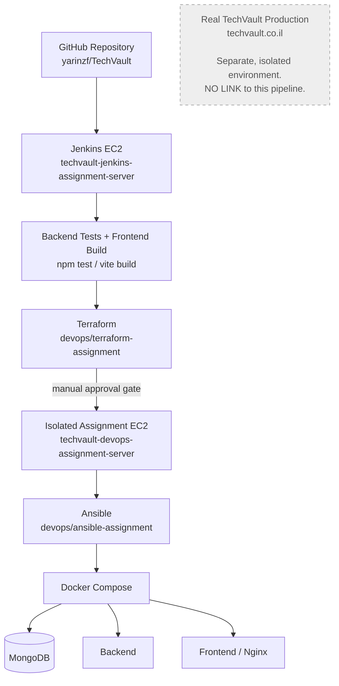
```mermaid
flowchart TD
    GH["GitHub Repository<br/>yarinzf/TechVault"] --> JK["Jenkins EC2<br/>techvault-jenkins-assignment-server"]
    JK --> TB["Backend Tests + Frontend Build<br/>npm test / vite build"]
    TB --> TF["Terraform<br/>devops/terraform-assignment"]
    TF -->|manual approval gate| EC2["Isolated Assignment EC2<br/>techvault-devops-assignment-server"]
    EC2 --> AN["Ansible<br/>devops/ansible-assignment"]
    AN --> DC["Docker Compose"]
    DC --> MDB[("MongoDB")]
    DC --> BE["Backend"]
    DC --> FE["Frontend / Nginx"]

    PROD["Real TechVault Production<br/>techvault.co.il<br/><br/>Separate, isolated environment.<br/>NO LINK to this pipeline."]

    style PROD fill:#eee,stroke:#999,stroke-dasharray:5 5,color:#555
```

The diagram is deliberately explicit about the one thing that matters most:
there is **no arrow** from any part of this pipeline into the "Real
TechVault Production" box. That separation is not just a diagram
convention — it is enforced in code at multiple layers (see
[Security Guards](#security-guards)).

---

## Production vs Assignment Isolation

| Aspect | Production (`techvault.co.il`) | Assignment environment |
|---|---|---|
| EC2 host | Existing, untouched by this pipeline | Separate, disposable (created/destroyed by Terraform) |
| Jenkins host | Does not run this pipeline | Dedicated, persistent EC2 (`techvault-jenkins-assignment-server`) |
| Terraform state | `devops/terraform/` (untouched) | `devops/terraform-assignment/` — fully separate state |
| Ansible inventory group | `devops/ansible/` (untouched) | `techvault_assignment` — separate group, separate deploy path |
| Database | Real product catalog | Separate MongoDB container, starts **empty** |
| SSH key pair | `techvault-key` (never used here) | `techvault-assignment-key` — dedicated, separate |

### Network access (SSH)

The assignment security group allows SSH (port 22) from **two** independent
sources, not one:

1. **The operator's own current public IP** — passed as the
   `ASSIGNMENT_SSH_CIDR` Jenkins job parameter (`allowed_ssh_cidr` in
   Terraform). This controls *direct SSH access for the operator's own
   machine* and should be checked before every run, since home/office IPs
   change:
   ```bash
   curl -4 https://checkip.amazonaws.com
   ```
   Enter the result as `<that-ip>/32`.
2. **The Jenkins host's own IP**, hardcoded as a second, always-present
   ingress rule. The **architectural principle** is: *the Jenkins host
   receives its own restricted `/32` SSH ingress rule on the Assignment
   Security Group*, independent of the operator's parameter — this exists
   because `devops/ansible-assignment/deploy.yml` SSHes in *from* the
   Jenkins host during the "Ansible Deploy" stage. The **current deployed
   value** of that rule is `3.68.18.214/32`, matching the Jenkins host as it
   is provisioned today — this is an implementation detail of the current
   deployment, not a permanent architectural constant. If the Jenkins host
   is ever recreated with a different IP, this rule must be updated to
   match.

```hcl
# devops/terraform-assignment/main.tf
ingress {
  description = "SSH"
  from_port   = 22
  to_port     = 22
  protocol    = "tcp"
  cidr_blocks = [
    var.allowed_ssh_cidr,
    "3.68.18.214/32"   # current Jenkins host IP — see note above
  ]
}
```

Because these are two independent rules, a **stale `ASSIGNMENT_SSH_CIDR`
does not break the pipeline** — Jenkins/Ansible deployment still succeeds,
since the Jenkins host's own SSH access is unaffected by the parameter. A
stale value only costs the *operator* their own direct SSH access to the
instance.

`0.0.0.0/0` is rejected by `Jenkinsfile.assignment`'s "Validate Project"
stage (a hard build failure) before Terraform ever runs — but is **not**
independently blocked by Terraform's own variable validation, which only
checks CIDR syntax. Manual (non-Jenkins) `terraform apply` runs are not
protected by that guard.

### Environment semantics — NODE_ENV and demo data

- `NODE_ENV=production` means the backend is running in production runtime
  mode. It does **not** mean this EC2 instance is the real TechVault
  production environment. The assignment environment remains fully isolated
  from `techvault.co.il` — entirely separate EC2 hosts, separate state,
  separate databases, separate credentials.
- The assignment MongoDB container starts **completely empty**. Demo product
  data is available only via an explicit, opt-in seed step
  (`run_seed_scripts: true`, off by default) — see
  [`devops/ansible-assignment/README.md`](../ansible-assignment/README.md).
  An assignment frontend with no products listed is expected, not a bug.

### HTTPS decision

Both the assignment application and the Jenkins host deploy **HTTP-only,
always, by design**. HTTPS/Certbot automation was deliberately removed after
a review found that a manually-set "enable HTTPS" flag, disconnected from
whether a certificate actually existed yet, could cause the Nginx template
to reference a nonexistent certificate path — which on a fresh instance can
prevent Nginx from starting at all, breaking HTTP too. Full reasoning and
manual HTTPS steps: [`devops/ansible-assignment/README.md`](../ansible-assignment/README.md#https-architecture-decision).

---

## Repository Structure

```
devops/
├── terraform/                   PRODUCTION Terraform (existing, untouched)
├── terraform-assignment/        ASSIGNMENT APPLICATION Terraform — separate state, separate everything
│   ├── provider.tf
│   ├── variables.tf              environment_name, key_pair_name, allowed_ssh_cidr, Jenkins ingress vars
│   ├── main.tf                   Security group + EC2, with lifecycle preconditions
│   ├── outputs.tf                assignment_instance_id/public_ip/private_ip/frontend_url/jenkins_url
│   ├── terraform.tfvars.example
│   └── README.md
├── terraform-jenkins/           JENKINS HOST Terraform — a third, separate state
├── ansible/                      PRODUCTION Ansible (existing, untouched)
├── ansible-assignment/           ASSIGNMENT APPLICATION Ansible — separate inventory group, separate deploy dir
│   ├── deploy.yml
│   ├── group_vars/techvault_assignment.yml
│   ├── templates/env.docker.assignment.j2
│   ├── templates/nginx-assignment.conf.j2
│   └── README.md
├── ansible-jenkins/              JENKINS HOST Ansible — provisions Jenkins/Docker/Terraform/Ansible/Node
├── jenkins/
│   ├── Jenkinsfile               PRODUCTION pipeline (existing, untouched)
│   ├── Jenkinsfile.assignment    ASSIGNMENT pipeline — 15 stages + safety guards
│   └── README.md
└── docs/
    ├── DEVOPS_ASSIGNMENT.md               This file
    ├── assignment-screenshots/            32 approved, unmodified original screenshots
    └── assignment-screenshots-safe/       4 presentation copies with the operator's personal CIDR redacted
```

The PDF protocol document is submitted separately to the lecturer/course
system and does not live in this GitHub repository.

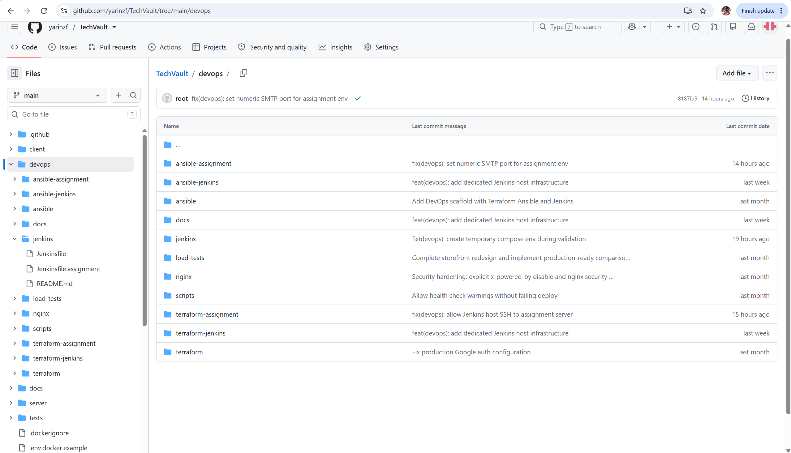

**Figure — Repository structure.** The `devops/` tree on GitHub, showing the
`*-assignment` / `*-jenkins` / production directories side by side — the
separation described above is visible directly in the file layout.

---

## Terraform

Terraform provisions the core AWS resources for the isolated environments:
an EC2 instance and Security Group for the Assignment environment, and an
EC2 instance and Security Group for the Jenkins host. The Jenkins-host
module can also allocate an optional Elastic IP; this option is enabled in
the current deployed Jenkins environment (see
[Jenkins Host](#jenkins-host)).

Each module is an independent Root Module with its own state file. There is
no `terraform_remote_state` reference between the Production, Assignment,
and Jenkins-host states. Under the configured modules and documented
workflow, an apply or destroy executed from one module manages only the
resources tracked by that module's own state — this is enforced by
separate module directories, separate state files, the absence of any
production instance ID as an input, the validation/precondition blocks
described below, and the Jenkins runtime guards described in
[Security Guards](#security-guards).

Input validation rejects production-like values before `terraform plan` is
even attempted:

```hcl
# devops/terraform-assignment/variables.tf
variable "environment_name" {
  description = "Short identifier for this disposable assignment environment."
  type        = string
  default     = "devops-assignment"

  validation {
    condition     = !can(regex("(?i)prod", var.environment_name)) && lower(var.environment_name) != "techvault"
    error_message = "environment_name must not reference production (no 'prod' substring, and not the bare app name)."
  }
}
```

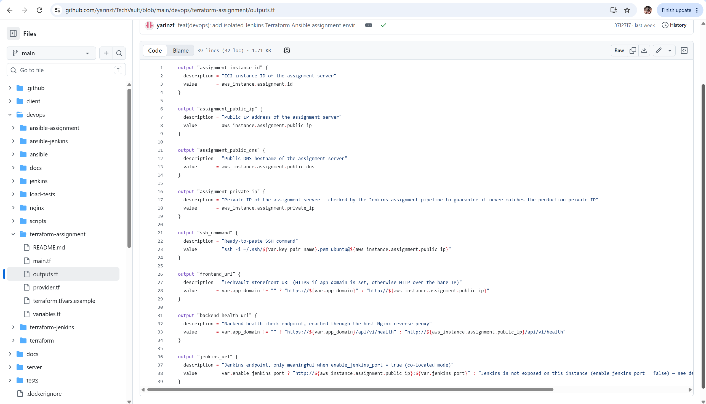

**Figure — `outputs.tf`.** The Terraform outputs the pipeline reads in the
"Read Assignment Outputs" stage: instance ID, public/private IP, a
ready-to-paste SSH command, and the frontend/health URLs.

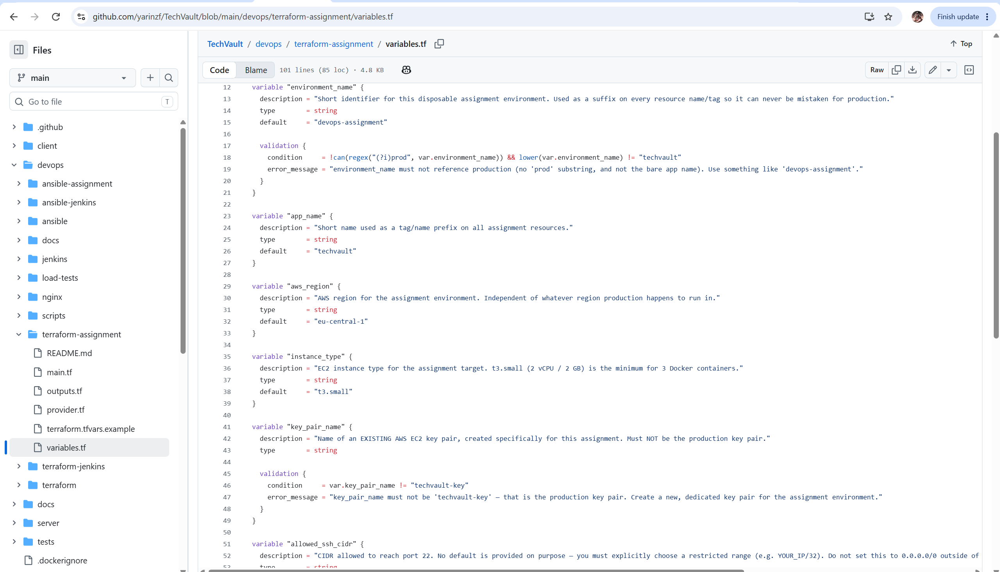

**Figure — `variables.tf`.** All module inputs and their validation blocks.

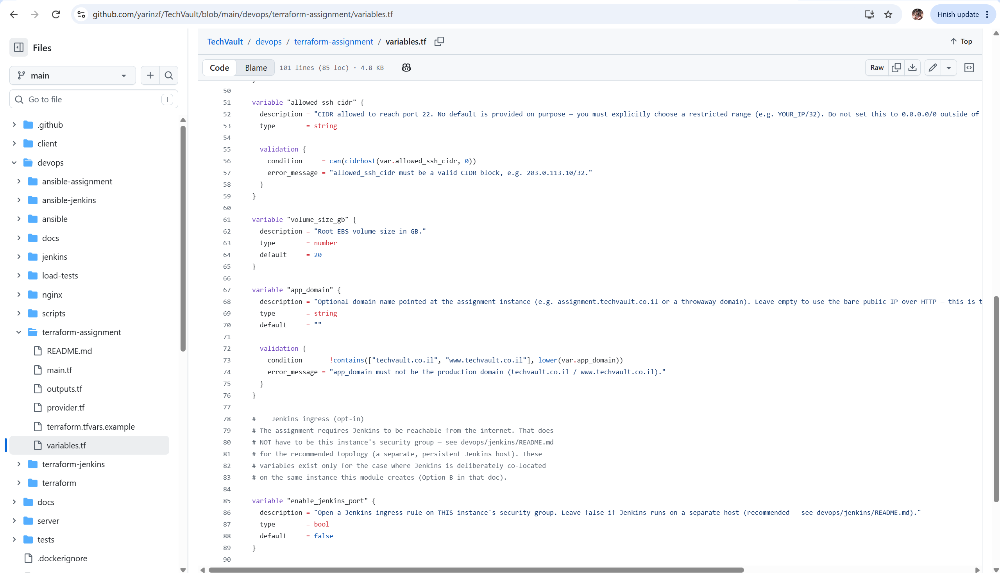

**Figure — CIDR validation.** `allowed_ssh_cidr` has no default on purpose —
an explicit, restricted value must be supplied on every run. The optional
`enable_jenkins_port` variables (Option B, co-located Jenkins) are also
defined here, disabled by default.

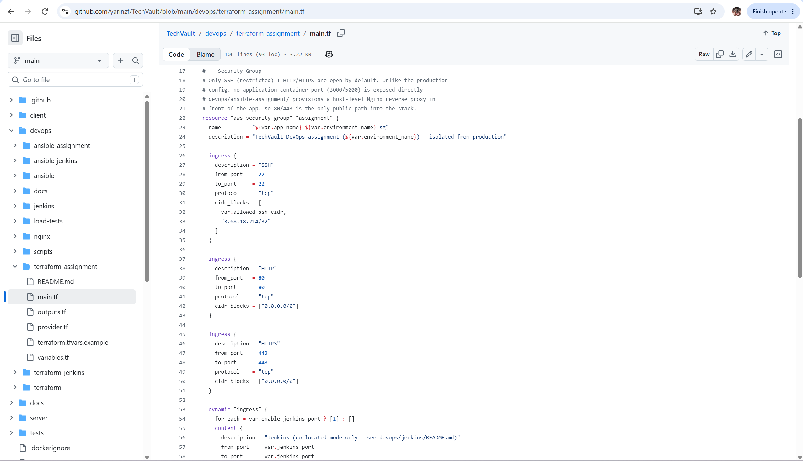

**Figure — `main.tf` security group.** Note the dual-source SSH ingress rule
described above (lines 31–34): the operator's CIDR and the Jenkins host's
CIDR, as two separate entries in the same rule.

---

## AWS Infrastructure

As a result of `terraform apply`, the assignment server runs as a `t3.small`
EC2 instance in `eu-central-1`, with public IP `63.180.236.144` and private
IP `172.31.45.35`. Its security group has exactly four inbound rules: two
SSH sources (as described above), plus HTTP and HTTPS open to the public.

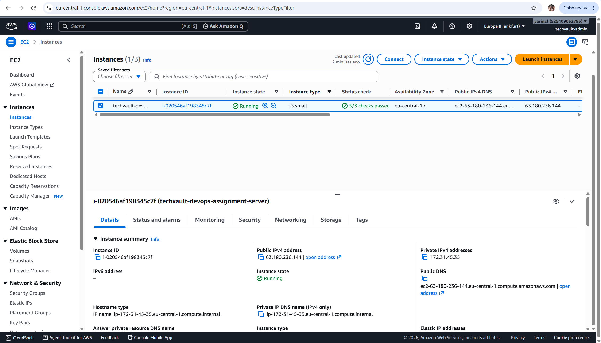

**Figure — AWS EC2 console.** `techvault-devops-assignment-server`, Running,
`t3.small`, IPs matching this document.

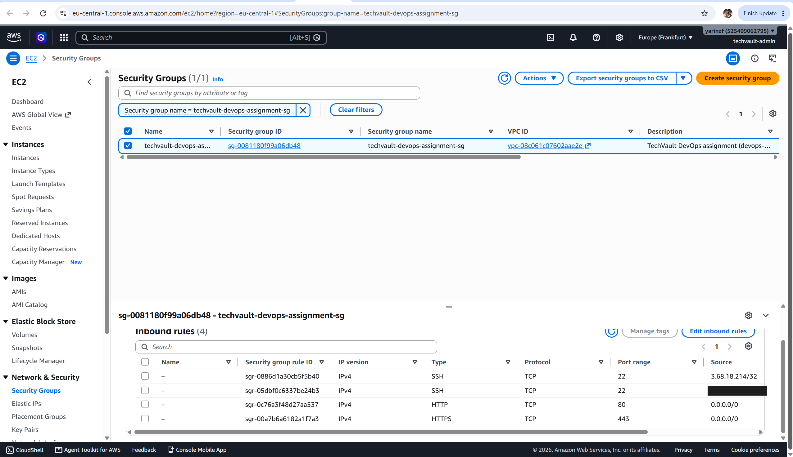

**Figure — Security group inbound rules.** Four rules: two SSH sources, HTTP,
HTTPS. **This is a presentation copy** — the operator's personal home CIDR
in the second SSH row is covered by an opaque box; the original,
unmodified screenshot lives in `devops/docs/assignment-screenshots/` and is
not embedded in this document. The Jenkins host's CIDR (`3.68.18.214/32`)
remains fully visible.

---

## Ansible

`devops/ansible-assignment/deploy.yml` handles everything that happens
*inside* the EC2 instance once it exists: installing Docker, cloning the
repository, rendering the environment file, configuring Nginx, starting the
Docker Compose stack, and validating the result. The first task in the play
is a hard safety gate:

```yaml
# devops/ansible-assignment/deploy.yml
- name: Refuse to run against anything but the assignment inventory group
  assert:
    that:
      - "'techvault_assignment' in group_names"
    fail_msg: >-
      This playbook must only run against hosts in the [techvault_assignment]
      inventory group. Refusing to continue — check inventory.ini.
    success_msg: "Target confirmed: techvault_assignment group"
```

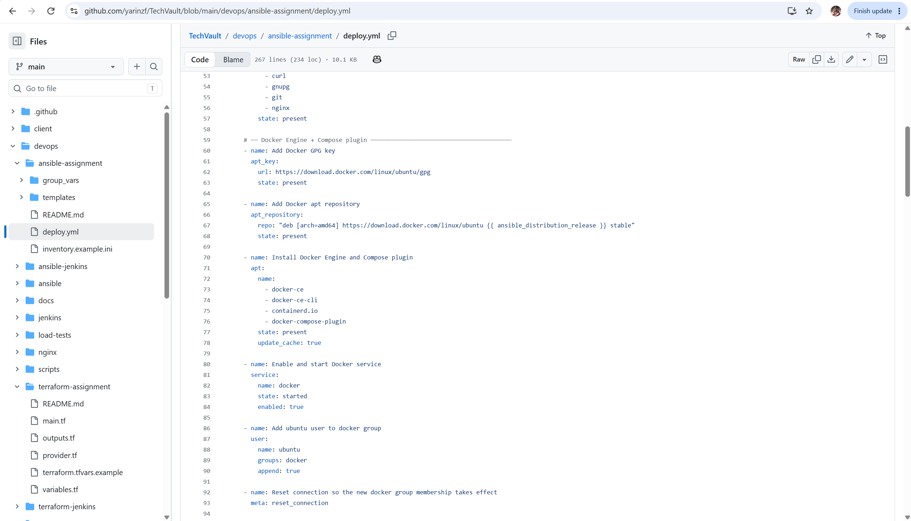

**Figure — `deploy.yml`.** Docker Engine + Compose plugin installation,
including adding the `ubuntu` user to the `docker` group.

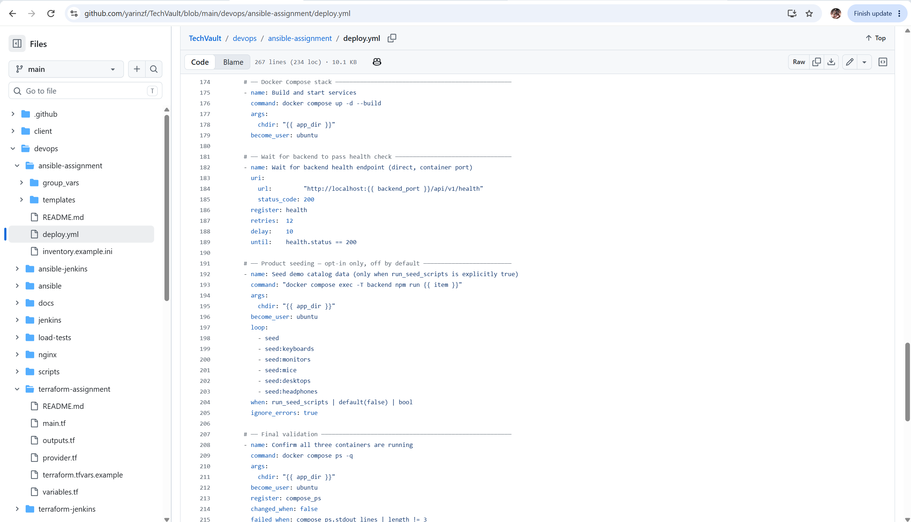

**Figure — `deploy.yml`.** Starting the Docker Compose stack, waiting for a
healthy backend, and the optional (default-off) demo-catalog seeding step.

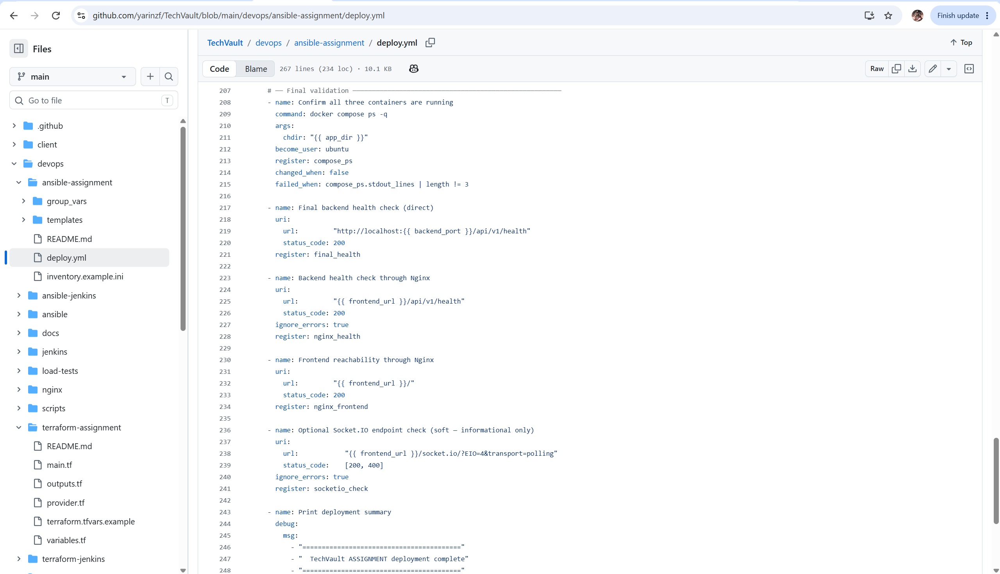

**Figure — `deploy.yml`.** The final validation block: container count,
direct + Nginx-proxied health checks, frontend reachability, and a soft
Socket.IO check.

---

## Docker Compose

`docker-compose.yml` defines three services — `mongodb` (image `mongo:7.0`),
`backend` (built from the repository `Dockerfile`, depends on Mongo being
healthy), and `frontend` (built from `client/`, depends on the backend being
healthy) — sharing one internal Docker network. Each service has its own
health check:

```yaml
# docker-compose.yml
mongodb:
  healthcheck:
    test: ["CMD", "mongosh", "--eval", "db.adminCommand('ping')"]
    interval: 10s
    timeout: 5s
    retries: 5
    start_period: 15s

backend:
  healthcheck:
    test: ["CMD-SHELL", "wget -qO- http://localhost:5000/api/v1/health || exit 1"]
    interval: 15s
    timeout: 5s
    retries: 3
    start_period: 20s

frontend:
  healthcheck:
    test: ["CMD-SHELL", "curl -sf http://localhost/ > /dev/null || exit 1"]
    interval: 15s
    timeout: 5s
    retries: 3
```

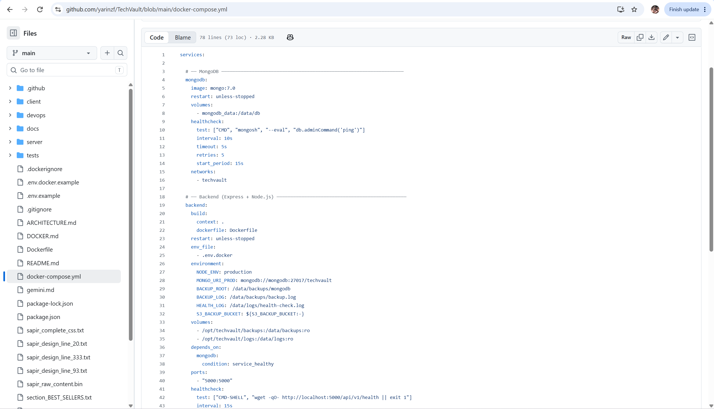

**Figure — `docker-compose.yml`.** MongoDB service definition and the start
of the backend service, including health checks.

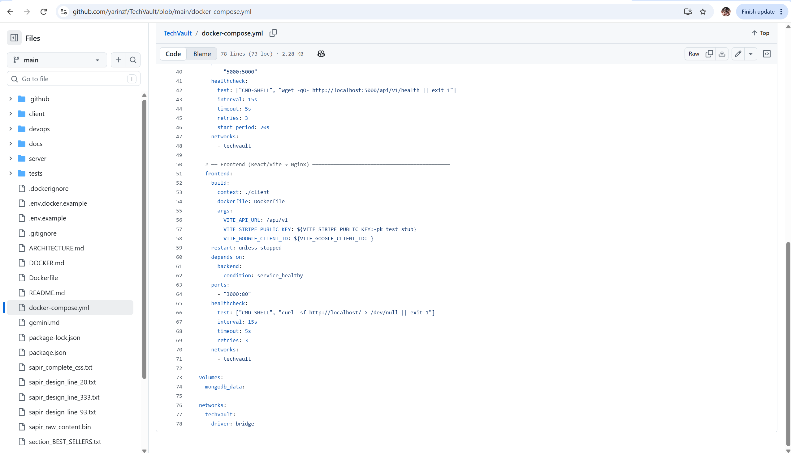

**Figure — `docker-compose.yml`.** The rest of the backend service, the
frontend service, the shared network, and the MongoDB data volume.

---

## Jenkins Host

The Jenkins host is a **persistent** EC2 instance, separate from the
disposable assignment application server — it is not created or destroyed
by any pipeline; it's the thing that runs the pipeline. Keeping it separate
means a `terraform destroy` on the assignment application never takes down
Jenkins itself (its job history, credentials, and configuration).

- Own Terraform state: `devops/terraform-jenkins/terraform.tfstate`
- Own Ansible inventory group: `jenkins_assignment`
- Own SSH key pair — a third, dedicated key pair, distinct from both
  `techvault-key` and the assignment application's key pair
- Port 8080 is never opened in the Security Group; Jenkins is bound to
  `127.0.0.1:8080` via a systemd drop-in override and is publicly reached
  through the host's Nginx reverse proxy on port 80. Port 443 is reserved
  in the Security Group for an optional later manual HTTPS configuration;
  the automated Jenkins provisioning itself is HTTP-only.
- Java: OpenJDK 21 (JRE), matching current Jenkins LTS's minimum requirement

**Current deployment:** `techvault-jenkins-assignment-server`, `t3.small`,
with an Elastic IP (`techvault-jenkins-assignment-eip`) allocated and
associated, so `3.68.18.214` is stable across stop/start.

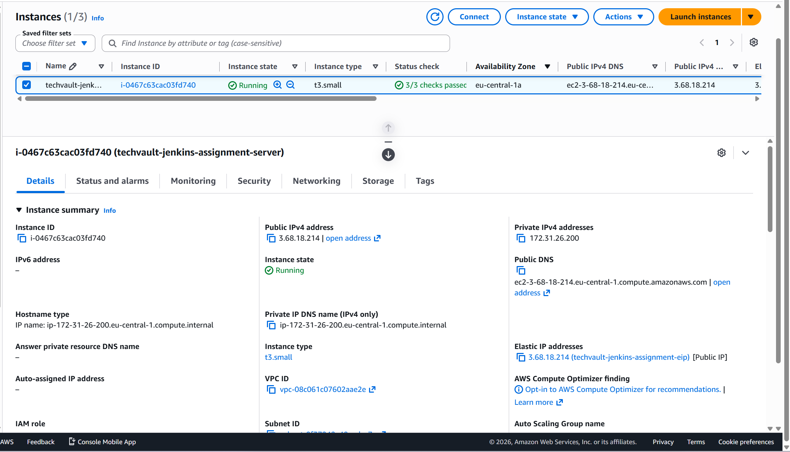

**Figure — AWS EC2 console.** `techvault-jenkins-assignment-server`,
Running, `t3.small`, Elastic IP attached.

---

## Jenkins Job and Parameters

Job name: **`TechVault-DevOps-Assignment`**, defined as "Pipeline script from
SCM" reading `devops/jenkins/Jenkinsfile.assignment` directly from GitHub.
Every run requires four parameters:

| Parameter | Default | Notes |
|---|---|---|
| `ASSIGNMENT_KEY_PAIR_NAME` | *(none)* | Required. Must not be `techvault-key` |
| `ASSIGNMENT_SSH_CIDR` | *(none)* | Required. The operator's current public IP in CIDR form |
| `ASSIGNMENT_AWS_REGION` | `eu-central-1` | Safe to leave as default |
| `ASSIGNMENT_INSTANCE_TYPE` | `t3.small` | Safe to leave as default |

`ASSIGNMENT_SSH_CIDR` controls only the operator's own direct SSH access —
not pipeline success (see [Network access (SSH)](#production-vs-assignment-isolation)).

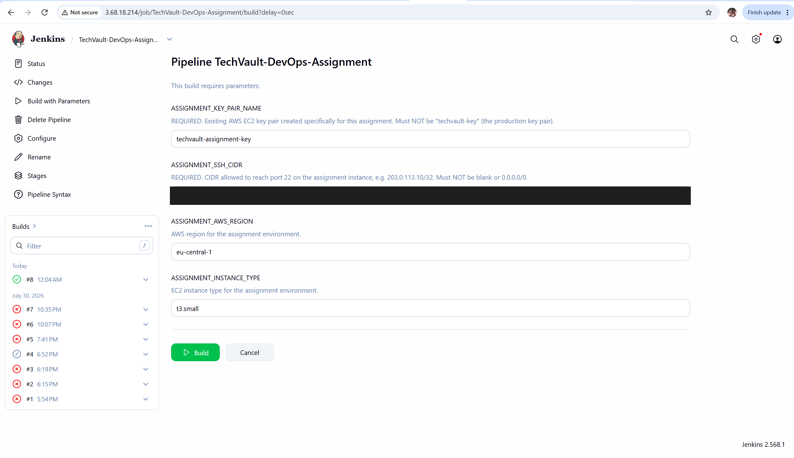

**Figure — Build with Parameters.** The four required parameters. **This is
a presentation copy** — the `ASSIGNMENT_SSH_CIDR` value (the operator's
personal home IP) is covered by an opaque box; the original screenshot is
not embedded in this document.

---

## Pipeline Stages

```groovy
// devops/jenkins/Jenkinsfile.assignment — representative stage
stage('Manual Approval') {
    input {
        message 'Review the plan above. It must ONLY create new resources tagged for the assignment environment, and must never reference the production instance ID or IPs printed in this Jenkinsfile. Apply?'
        ok      'Apply — plan reviewed, no production resource is affected'
    }
    steps {
        echo 'Approved by a human reviewer — proceeding to apply.'
    }
}
```

| # | Stage | What it does |
|---|-------|-------------|
| 1 | Checkout | Pull latest code from GitHub |
| 2 | Validate Project | Static safety guard + required job-parameter checks |
| 3 | Run Backend Tests | `npm ci && npm test` |
| 4 | Build Frontend | `npm ci && npm run build` in `client/` |
| 5 | Validate Docker Compose | `docker compose config --quiet` |
| 6 | Terraform Init | `terraform init` |
| 7 | Terraform Validate | `terraform validate` |
| 8 | Terraform Plan | Computed and saved to `tfplan` |
| 9 | Manual Approval | **Human must click Apply** |
| 10 | Terraform Apply | Creates the assignment EC2 + security group |
| 11 | Read Assignment Outputs | Fails the build if any output equals a production identifier |
| 12 | Generate Assignment Inventory | Dynamic Ansible inventory from Terraform outputs |
| 13 | Ansible Syntax Check | `ansible-playbook --syntax-check` |
| 14 | Ansible Deploy | Runs `deploy.yml` with injected secrets |
| 15 | Validate Assignment Website | curl health + frontend, fails on non-200 |

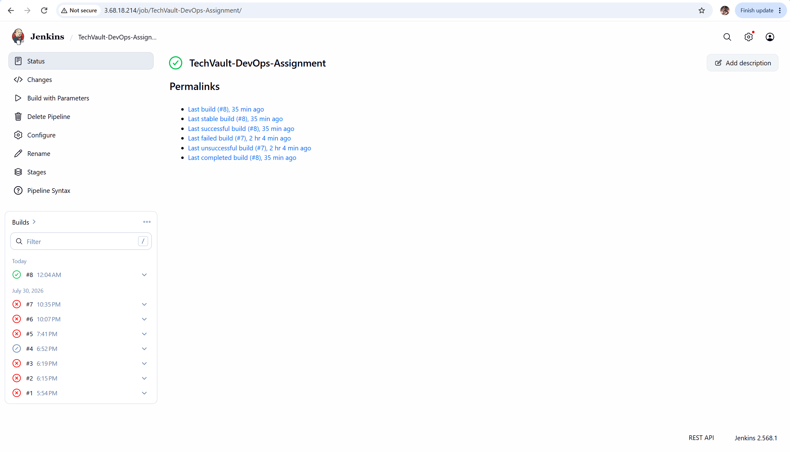

**Figure — Job status.** Build #8 marked green, with links to last/stable/
successful builds all pointing at the same run.

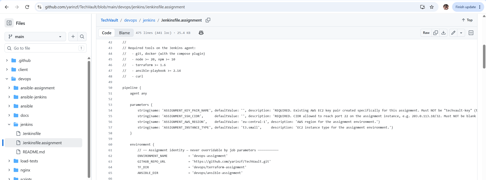

**Figure — `Jenkinsfile.assignment` source.** The `parameters` block and the
start of the `environment` block, which defines the production identifiers
used for the comparison in [Security Guards](#security-guards).

---

## Backend Tests

Stage 3 runs the full Jest suite. Build #8's result: **72 tests passed out
of 72, across 6 test suites, 0 failures.**

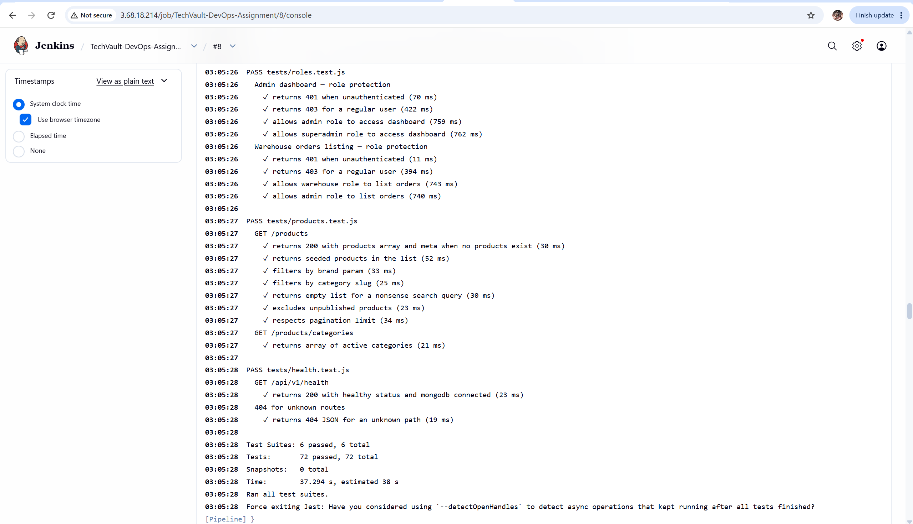

**Figure — Jest output.** `Test Suites: 6 passed, 6 total`;
`Tests: 72 passed, 72 total`.

---

## Frontend Build

Stage 4 runs a full Vite production build — minification, chunk splitting,
gzip-size reporting. Build #8 completed in ~14.6 seconds after transforming
2,540 modules.

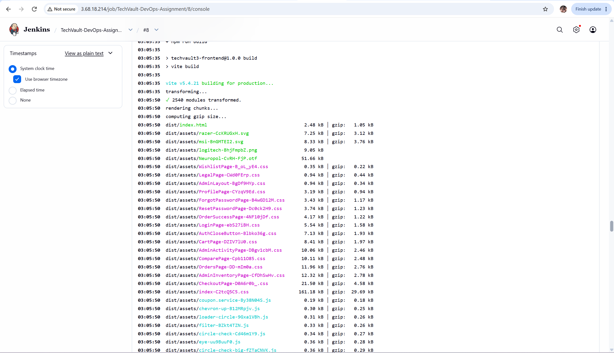

**Figure — Vite build output.** The asset list and gzip sizes for the
production bundle.

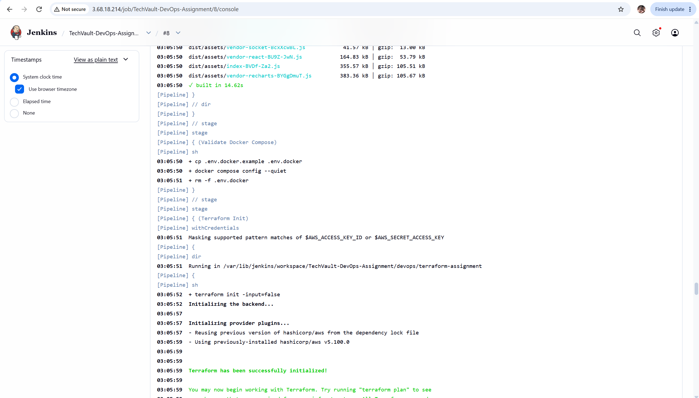

**Figure — Build completion.** `built in 14.62s`, immediately followed by the
start of the next stage (Docker Compose validation, Terraform Init).

---

## Terraform Plan, Approval and Apply

Stage 8 (`terraform plan`) on Build #8 returned:
**`No changes. Your infrastructure matches the configuration.`**

This is a **positive** result, not a null one: it means the AWS resources
currently tracked by this Terraform state already match the declared
configuration, with no changes required at the time of the plan. This
demonstrates consistent, idempotent desired-state management for the
existing Assignment environment. A no-change plan by itself is not evidence
of a complete from-scratch recreation.

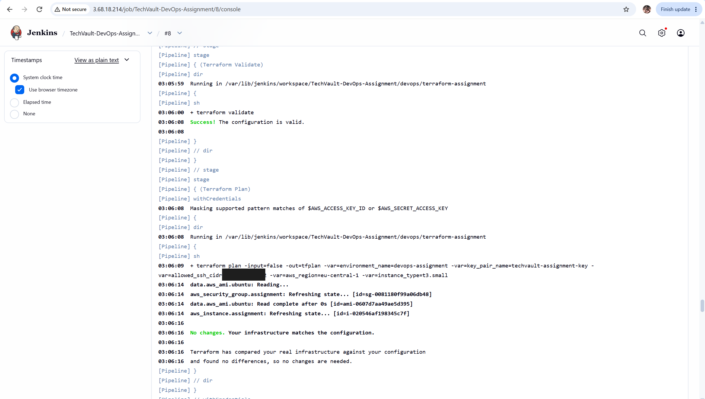

**Figure — `terraform validate` + `terraform plan`.** **This is a
presentation copy** — the operator's personal CIDR inline in the wrapped
`terraform plan` command is covered by an opaque box; the original
screenshot is not embedded in this document.

The pipeline then halts completely at stage 9 and waits for a human to
review the plan and click Apply:

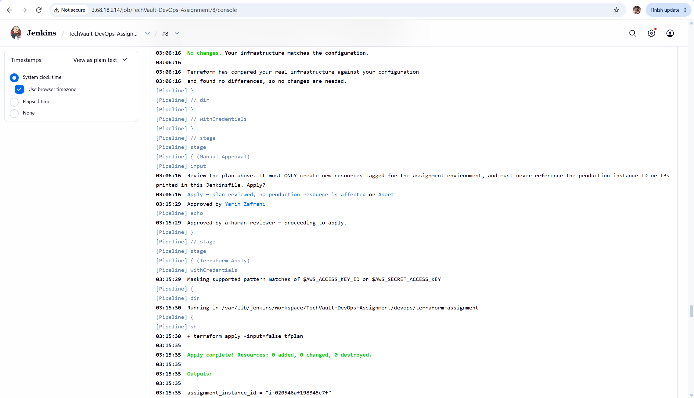

**Figure — Manual Approval gate.** The full warning message, the human
approval ("Approved by Yarin Zafrani"), and the Apply result:
`0 added, 0 changed, 0 destroyed` — consistent with the "No changes" plan.

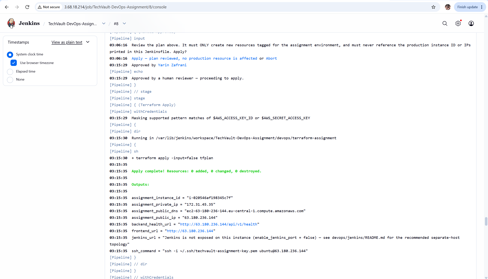

**Figure — Terraform outputs.** Instance ID, IPs, and the final frontend/
health URLs, printed immediately after Apply.

---

## Ansible Deployment

Stage 12 generates a dynamic inventory from the Terraform outputs, stage 13
runs a syntax-only check, and stage 14 runs `deploy.yml` for real.

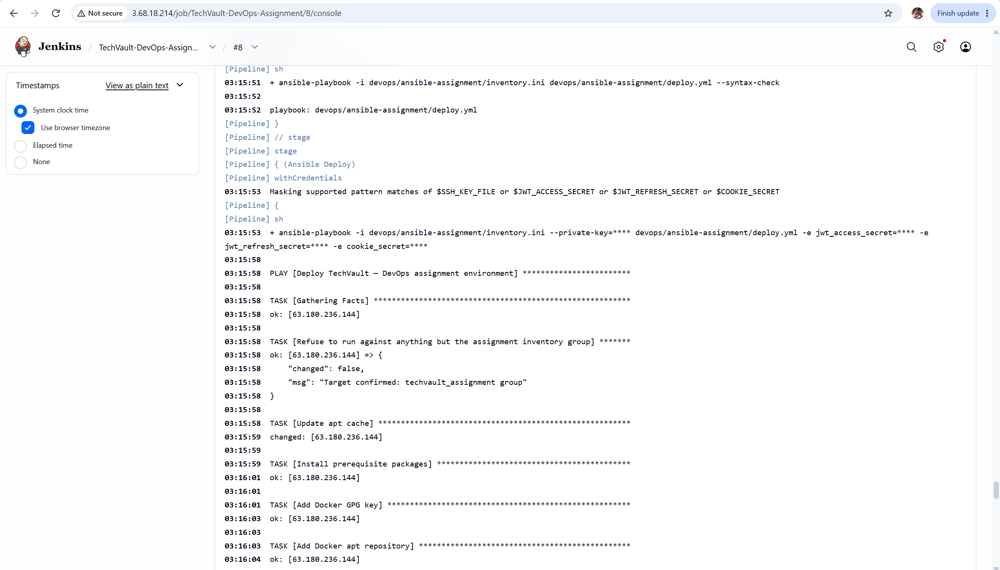

**Figure — Start of `deploy.yml`.** Syntax check, the inventory-group safety
assertion, and the start of base-package installation.

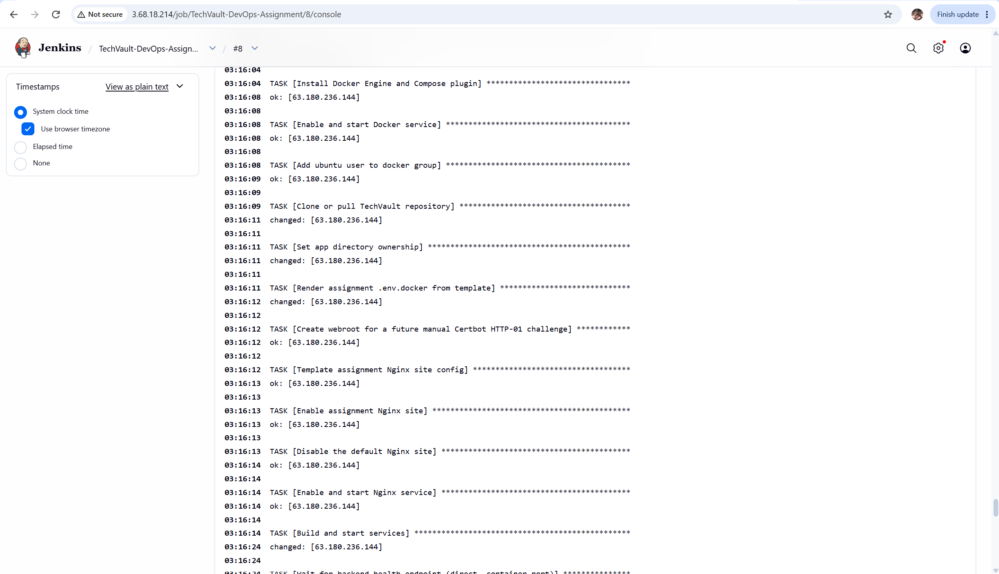

**Figure — `deploy.yml` continued.** Docker installation, repository clone,
environment-file rendering, Nginx configuration, and starting the Docker
Compose stack.

```yaml
# devops/ansible-assignment/deploy.yml — final validation excerpt
- name: Confirm all three containers are running
  command: docker compose ps -q
  register: compose_ps
  changed_when: false
  failed_when: compose_ps.stdout_lines | length != 3

- name: Backend health check through Nginx
  uri:
    url:         "{{ frontend_url }}/api/v1/health"
    status_code: 200
```

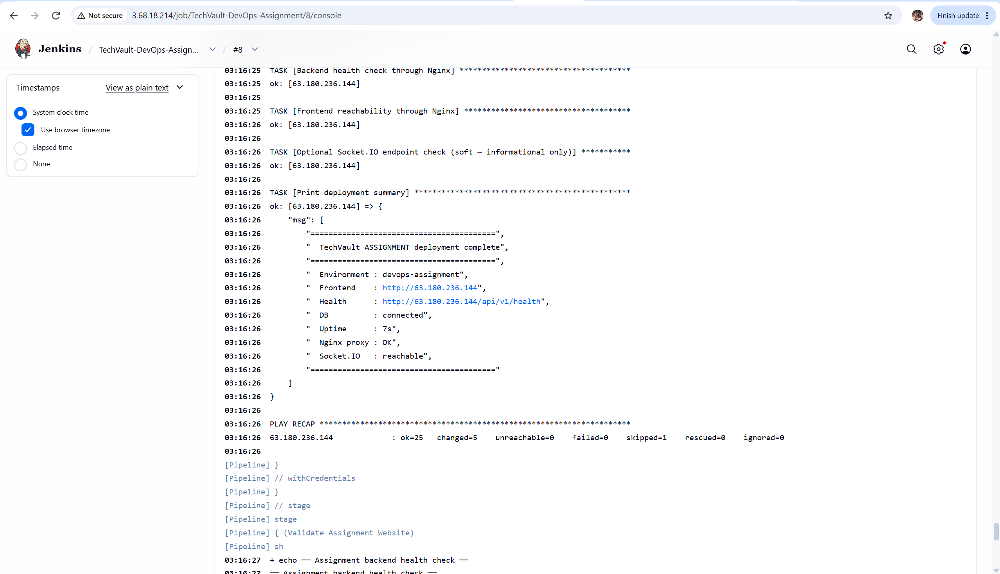

**Figure — Deployment summary + PLAY RECAP.** `failed=0, unreachable=0` —
no failures, no connectivity issues.

---

## Final Validation

The last pipeline stage (15) checks the live site exactly as a real user
would — through the public IP and Nginx, not the containers directly.

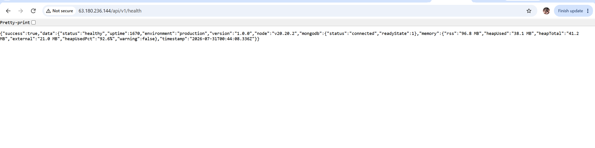

**Figure — `/api/v1/health` response.** `status: healthy`,
`mongodb.status: connected`, `environment: production`.

The `"environment": "production"` field is `NODE_ENV`, which selects the
Node.js runtime mode only — it does not identify this server as the real
TechVault production environment. This is a separate EC2 host with a
separate MongoDB, with no connection to `techvault.co.il`.

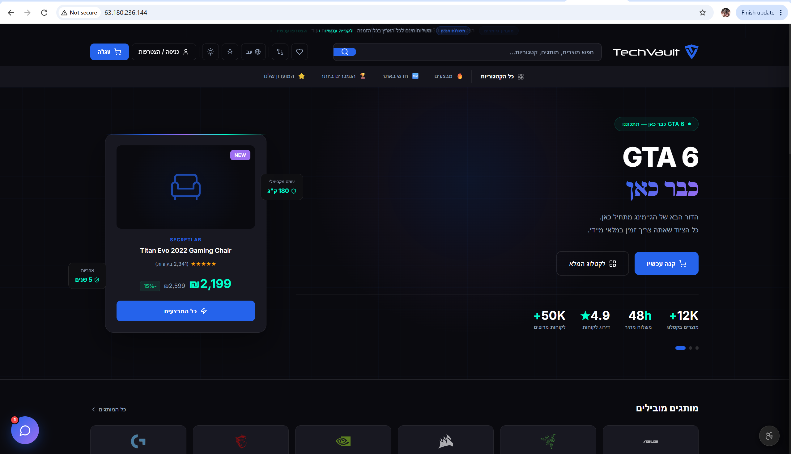

**Figure — Assignment frontend homepage**, loaded successfully through
Nginx. This proves the frontend builds and serves correctly; it does not by
itself indicate whether the product catalog has been seeded.

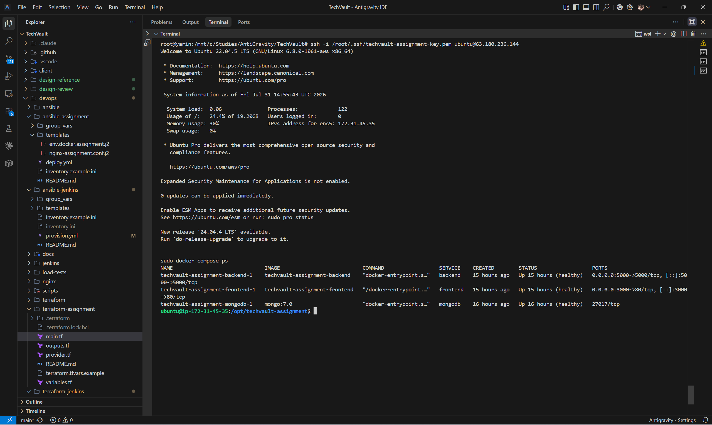

**Figure — `docker compose ps`** via a direct SSH session — all three
containers `Up` and `healthy`.

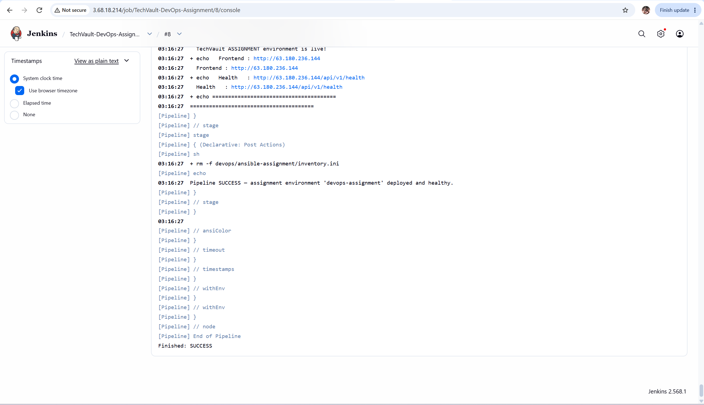

**Figure — End of the Build #8 console log.** `Pipeline SUCCESS —
assignment environment 'devops-assignment' deployed and healthy.` followed
by Jenkins's own `Finished: SUCCESS`.

---

## Security Guards

Several independent layers, none relying on the others:

```groovy
// devops/jenkins/Jenkinsfile.assignment — Validate Project stage (excerpt)
[ "${TF_DIR}" = "devops/terraform-assignment" ] || { echo "REFUSING: TF_DIR is not the assignment directory"; exit 1; }
[ "${TF_DIR}" != "${PRODUCTION_TF_DIR}" ]       || { echo "REFUSING: TF_DIR equals the production Terraform directory"; exit 1; }
case "${ENVIRONMENT_NAME}" in
    *[Pp][Rr][Oo][Dd]*) echo "REFUSING: ENVIRONMENT_NAME resembles production"; exit 1 ;;
esac
if [ "${ASSIGNMENT_KEY_PAIR_NAME}" = "techvault-key" ]; then
    echo "REFUSING: ASSIGNMENT_KEY_PAIR_NAME equals 'techvault-key' — that is the production key pair."
    exit 1
fi
```

```groovy
// Read Assignment Outputs stage — production-identifier comparison
if (env.SERVER_ID == env.PRODUCTION_INSTANCE_ID) {
    error("REFUSING TO CONTINUE: resolved instance ID equals the production instance ID.")
}
if (env.SERVER_IP == env.PRODUCTION_PUBLIC_IP) {
    error("REFUSING TO CONTINUE: resolved public IP equals the current production public IP.")
}
```

Summary of every layer:

- **Stage 2 (Validate Project):** static checks that Terraform/Ansible paths
  and `ENVIRONMENT_NAME` never resemble production; rejects
  `ASSIGNMENT_KEY_PAIR_NAME=techvault-key`; rejects `ASSIGNMENT_SSH_CIDR`
  that is blank, `0.0.0.0/0`, or not a real CIDR (range/octet validated, not
  just pattern-matched).
- **Stage 11 (Read Assignment Outputs):** compares the *actual* Terraform
  outputs against the known production instance ID and IPs, and aborts the
  build immediately on any match.
- **Terraform itself:** `variables.tf` validation blocks and
  `lifecycle.precondition` in `main.tf` refuse to plan at all if inputs
  drift toward production-like values.
- **Ansible:** the first task in every play asserts the target host belongs
  to the correct inventory group before doing anything else.
- **Network:** Docker Compose maps the application ports (3000/5000) on the
  EC2 host, but the Security Group has no ingress rule for either — they are
  not reachable from the internet, only through the host's own Nginx on
  port 80. Port 443 is open in the Security Group, but the automated
  assignment deployment itself is HTTP-only, always (see
  [HTTPS decision](#https-decision)) — 443 is reserved
  for a possible manual, later HTTPS step, not used by the pipeline. SSH is
  restricted to exactly two `/32` sources (see
  [Network access (SSH)](#production-vs-assignment-isolation)).

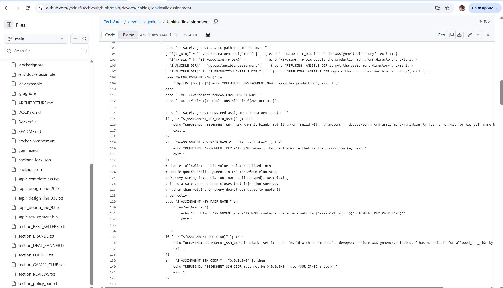

**Figure — `Jenkinsfile.assignment` safety guard.** Path checks,
`ASSIGNMENT_KEY_PAIR_NAME` validation, and the start of `ASSIGNMENT_SSH_CIDR`
validation including the `0.0.0.0/0` rejection.

---

## Lecturer Access

| Detail | Value |
|---|---|
| Jenkins URL | http://3.68.18.214/ |
| Job name | `TechVault-DevOps-Assignment` |
| Lecturer username / display name | `DevOps Instructor` |
| Permissions | View, run Build with Parameters — no admin rights |
| Password | Supplied separately — not included in this document |

The instructor account can view the job, view stages, and trigger
`Build with Parameters` independently. It cannot reach Configure, Delete
Pipeline, or Manage Jenkins.

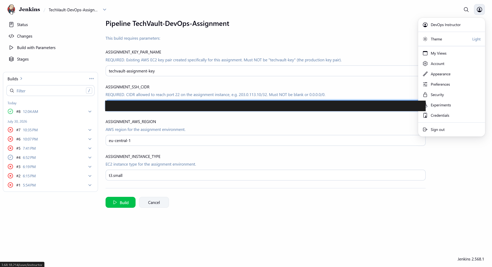

**Figure — `DevOps Instructor` logged in**, on the Build with Parameters
screen, with no admin surface visible anywhere in the UI. **This is a
presentation copy** — the `ASSIGNMENT_SSH_CIDR` field is covered by an
opaque box; the original screenshot is not embedded in this document.

---

## Troubleshooting and Implementation Journey

As the build-history graph below shows, reaching Build #8 was not a
straight line — earlier runs surfaced several distinct, real issues before
the pipeline succeeded end to end. The items below are grouped by kind
rather than mapped one-to-one onto specific build numbers; more than one
issue could affect a given run, and not every failed run necessarily
corresponds to a unique root cause.

### Pipeline issues encountered before Build #8

1. **Docker Compose validation had no `.env.docker`.** `docker compose
   config --quiet` requires the env file to exist even just to validate
   syntax. Fixed by having the "Validate Docker Compose" stage copy
   `.env.docker.example` → `.env.docker` before validating, then removing
   it.
2. **Manual Approval timeout.** An earlier run timed out while waiting at
   the human approval gate. This was an execution/run-management issue —
   nobody clicked Apply in time — not an infrastructure or code defect.
3. **AWS rejected a Security Group description containing a Unicode em
   dash.** Fixed by using plain ASCII punctuation in AWS-facing Security
   Group descriptions.
4. **Jenkins/Ansible could not SSH to the Assignment EC2.** Only the
   operator's home CIDR had been allowed, but Ansible connects *from* the
   Jenkins host. Fixed by adding the Jenkins host's own restricted `/32` as
   an independent SSH source (see
   [Network access (SSH)](#production-vs-assignment-isolation)).
5. **Backend container was unhealthy/restarting because `SMTP_PORT` was
   empty.** Fixed by setting `SMTP_PORT=587` in the Assignment environment
   template.

After resolving the pipeline-blocking issues above, Build #8 completed the
full end-to-end pipeline successfully.

### Additional compatibility and hardening fixes

These are separate, later hardening changes on the Jenkins host side —
compatibility updates and defensive fixes, not fixes for a specific failed
Assignment build:

- **Java runtime updated to OpenJDK 21** on the Jenkins host, matching
  current Jenkins LTS's minimum requirement.
- **Jenkins apt signing key rotated** to the current 2026 LTS key, with
  `force: true` added so re-provisioning always refreshes it.
- **Jenkins loopback bind-check false positive resolved** — the check now
  accepts both `127.0.0.1:8080` and its IPv4-mapped-IPv6 form
  (`[::ffff:127.0.0.1]:8080`) as valid loopback bindings, while still
  rejecting every wildcard form.
- **Jenkins-host AWS Security Group descriptions converted to ASCII**
  (same class of fix as the em-dash issue above, applied to the
  `terraform-jenkins` module).
- **Preventive ASCII fix in the dormant co-located-Jenkins ingress rule** —
  the same em-dash pattern was found and corrected in a disabled-by-default
  ingress rule, even though that code path has never been exercised.

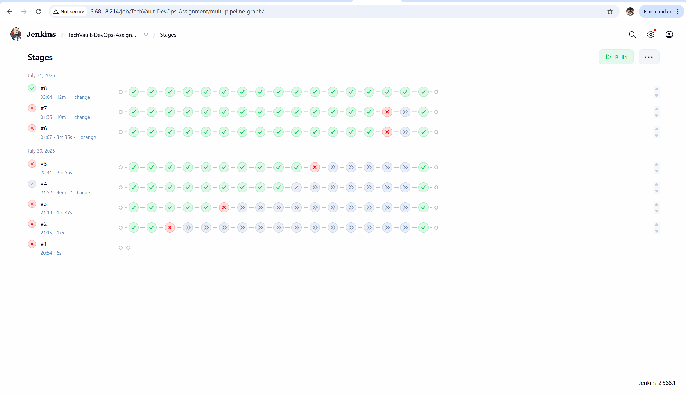

**Figure — Build-by-build stage graph.** Builds #1–#7 show failures at
various stages (red ✗); Build #8 shows all 15 stages green (✓). The graph
does not attribute each earlier failure to a specific item listed above —
it illustrates the overall iterative process that led to the final
successful run.

---

## Final Build #8 Results

| Check | Result |
|---|---|
| Backend tests | **72 passed, 72 total** |
| Test suites | **6 passed, 6 total** |
| Frontend production build (Vite) | **Succeeded** |
| `terraform validate` | Passed |
| Terraform final plan | **No changes** |
| Terraform final apply | **0 added, 0 changed, 0 destroyed** |
| Ansible PLAY RECAP | **failed=0, unreachable=0** |
| Backend health | **healthy** |
| MongoDB | **connected** |
| Nginx reverse proxy | **OK** |
| Socket.IO | **reachable** |
| Frontend (through Nginx) | **HTTP 200** |
| Pipeline result | **Finished: SUCCESS** |

Docker services on the assignment server, all healthy: `mongodb`, `backend`,
`frontend`.

---

## How to Run the Assignment

1. Log in to Jenkins at http://3.68.18.214/ (credentials supplied
   separately).
2. Open the `TechVault-DevOps-Assignment` job.
3. Click **Build with Parameters**.
4. Check your current public IP and use it as `ASSIGNMENT_SSH_CIDR`:
   ```bash
   curl -4 https://checkip.amazonaws.com
   ```
5. Set `ASSIGNMENT_KEY_PAIR_NAME` to `techvault-assignment-key`; leave the
   remaining parameters at their defaults.
6. Click **Build** and follow progress in **Stages**.
7. At **Manual Approval**, review the plan and click **Apply** only after
   confirming it references no production resource.
8. After completion, confirm **Validate Assignment Website** succeeded and
   check the live endpoints listed in [Submission Overview](#submission-overview).

Manual (non-Jenkins) equivalents for each tool are documented in
[`devops/terraform-assignment/README.md`](../terraform-assignment/README.md)
and [`devops/ansible-assignment/README.md`](../ansible-assignment/README.md).

---

## Cost and Cleanup

Cost depends on instance type and running hours — this section explains the
factors, not an exact bill; check the AWS Pricing Calculator for a current,
region-accurate figure before committing to a longer-running instance.

**Factors:**
- The Jenkins host (default `t3.medium` in the module, `t3.small` in the
  current deployment, 40 GB gp3) runs for as long as you keep it — it is not
  created/destroyed by any pipeline, so its cost accrues the whole time it
  exists, independent of how often you actually run a build.
- The assignment application server (default `t3.small`, 20 GB gp3) only
  exists between a pipeline's Terraform Apply and whenever you
  `terraform destroy` it — no pipeline run, no cost from this one.
- EBS (root volume) storage costs money for as long as the volume exists,
  **including while the instance is stopped** — stopping halts compute
  charges but not storage charges.
- Stopping either instance (rather than destroying it) between work
  sessions pauses compute cost while keeping configuration/history intact —
  this works for the Jenkins host (stop/start preserves Jenkins home, jobs,
  credentials) but is not the normal lifecycle for the assignment
  application server, which is meant to be recreated by the pipeline.
- Both an automatically assigned EC2 public IPv4 address and an Elastic IP
  can incur public IPv4 address charges — the current deployment's Elastic
  IP is chosen for address *stability* across stop/start, not as a free
  alternative. Release any Elastic IP during final cleanup.

**Recommended lifecycle:**
- **Never destroy production** — `devops/terraform/` manages the real, live
  TechVault server; no destroy command should ever target it.
- The assignment application environment can be destroyed after grading is
  fully complete (all screenshots and the instructor's own pipeline run are
  done):
  ```bash
  cd devops/terraform-assignment && terraform destroy
  ```
- **Preserve the Jenkins host until all screenshots and instructor access
  are complete.** Recreating it means reinstalling Jenkins and
  reconfiguring plugins/credentials/instructor account from scratch.

---

## Secrets and Git Ignore

| What | Where it lives | Tracked in git? |
|---|---|---|
| Assignment AWS credentials, SSH key, JWT/cookie secrets | Jenkins → Manage Credentials | No — never committed |
| `devops/terraform-assignment/terraform.tfvars` | Local disk only | No — gitignored |
| `devops/terraform-assignment/terraform.tfstate*` | Local disk only | No — gitignored |
| `devops/ansible-assignment/inventory.ini` | Local disk / Jenkins workspace (deleted in `post { always }`) | No — gitignored |
| `devops/terraform-jenkins/terraform.tfvars` | Local disk only | No — gitignored |
| `devops/terraform-jenkins/terraform.tfstate*` | Local disk only | No — gitignored |
| `devops/ansible-jenkins/inventory.ini` | Local disk only | No — gitignored |
| Assignment / Jenkins-host `.pem` keys | Your `~/.ssh/` | No — `*.pem` is gitignored globally |
| Assignment `.env.docker` (rendered on the server) | `/opt/techvault-assignment/.env.docker` on the EC2 instance | No — never leaves the server |
| Jenkins initial admin password | `/var/lib/jenkins/secrets/initialAdminPassword` on the Jenkins host | No — never leaves the server; retrieved manually over SSH |

Production's equivalent files follow the same gitignore rules and are
unaffected by any of the above.

---

## Troubleshooting Reference

| Problem | Likely cause | Fix |
|---------|-------------|-----|
| `terraform apply` fails: `InvalidKeyPair.NotFound` | Key pair doesn't exist in AWS yet | Create it in the AWS console first — do not reuse `techvault-key` |
| Jenkins stage 11 fails with "REFUSING TO CONTINUE" | Terraform outputs resolved to a production identifier | Stop immediately — this means something is misconfigured; do not bypass the check |
| Ansible SSH timeout, EC2 freshly created | EC2 still initializing | Wait ~60s after apply, re-run |
| Operator cannot SSH directly to assignment EC2 | `ASSIGNMENT_SSH_CIDR` contains an old home/public IP | Check current public IPv4, update `ASSIGNMENT_SSH_CIDR` on the next run |
| Backend container exits | `.env.docker` secrets too short (<32 chars) | Check the three secret credentials in Jenkins |
| Frontend shows blank page | Nginx site not enabled / config invalid | `sudo nginx -t`, check `docker compose logs frontend` |
| Jenkins unreachable at `http://<ip>/` | Nginx not running, or Jenkins still starting | `sudo systemctl status nginx jenkins`, retry |
| `curl http://localhost:8080` fails from your workstation | Expected — Jenkins is bound to `127.0.0.1:8080` on the host itself | Use the Nginx-proxied URL on port 80 instead (443 is only live if HTTPS was configured manually) |

---

## Full Evidence Gallery

All 32 approved screenshots, indexed by source file and the section each is
embedded in above. Four are marked *(redacted copy)* — a presentation copy
under `assignment-screenshots-safe/` is what's embedded in this document;
the original, unmodified file under `assignment-screenshots/` is never
shown here.

| File | Section |
|---|---|
| `01-jenkins-build-success.png` | [Pipeline Stages](#pipeline-stages) |
| `02-jenkins-console-success.png` | [Final Validation](#final-validation) |
| `03-assignment-website.png` | [Final Validation](#final-validation) |
| `04-backend-health.png` | [Final Validation](#final-validation) |
| `05-jenkins-pipeline-stages.png` | [Troubleshooting and Implementation Journey](#troubleshooting-and-implementation-journey) |
| `06-terraform-plan-no-changes.png` *(redacted copy)* | [Terraform Plan, Approval and Apply](#terraform-plan-approval-and-apply) |
| `07-terraform-apply-outputs.png` | [Terraform Plan, Approval and Apply](#terraform-plan-approval-and-apply) |
| `08-ansible-deployment-success.png` | [Ansible Deployment](#ansible-deployment) |
| `09-aws-ec2-assignment-instance.png` | [AWS Infrastructure](#aws-infrastructure) |
| `10-aws-security-group-inbound-rules.png` *(redacted copy)* | [AWS Infrastructure](#aws-infrastructure) |
| `11-jenkins-build-parameters.png` *(redacted copy)* | [Jenkins Job and Parameters](#jenkins-job-and-parameters) |
| `12-jenkins-lecturer-user-permissions.png` *(redacted copy)* | [Lecturer Access](#lecturer-access) |
| `13-github-devops-assignment-structure.png` | [Repository Structure](#repository-structure) |
| `14-github-jenkinsfile-assignment.png` | [Pipeline Stages](#pipeline-stages) |
| `15-github-terraform-security-group.png` | [Terraform](#terraform) |
| `16-github-ansible-deploy-playbook.png` | [Ansible](#ansible) |
| `17-github-ansible-app-deployment.png` | [Ansible](#ansible) |
| `18-github-ansible-final-validation.png` | [Ansible](#ansible) |
| `19-github-docker-compose-backend.png` | [Docker Compose](#docker-compose) |
| `20-github-docker-compose-frontend.png` | [Docker Compose](#docker-compose) |
| `21-github-terraform-outputs.png` | [Terraform](#terraform) |
| `22-github-terraform-variables.png` | [Terraform](#terraform) |
| `23-github-terraform-cidr-validation.png` | [Terraform](#terraform) |
| `24-github-jenkins-ssh-safety-guard.png` | [Security Guards](#security-guards) |
| `25-jenkins-backend-tests-success.png` | [Backend Tests](#backend-tests) |
| `26-jenkins-frontend-build-output.png` | [Frontend Build](#frontend-build) |
| `27-jenkins-frontend-build-success.png` | [Frontend Build](#frontend-build) |
| `28-jenkins-manual-approval.png` | [Terraform Plan, Approval and Apply](#terraform-plan-approval-and-apply) |
| `29-jenkins-ansible-tasks.png` | [Ansible Deployment](#ansible-deployment) |
| `30-jenkins-ansible-deployment-tasks.png` | [Ansible Deployment](#ansible-deployment) |
| `31-aws-jenkins-instance.png` | [Jenkins Host](#jenkins-host) |
| `32-docker-compose-containers-running.png` | [Final Validation](#final-validation) |
